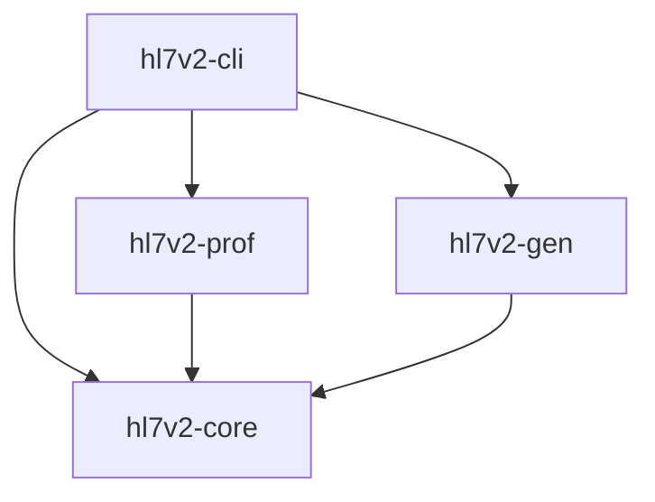

# HL7 v2 Toolkit Design Document

## 1. Overview

The HL7 v2 Toolkit is a comprehensive Rust-based implementation for parsing, validating, generating, and processing HL7 v2 messages. The toolkit consists of four main crates:

1. **hl7v2-core**: Core parsing and data model implementation
2. **hl7v2-prof**: Profile validation functionality
3. **hl7v2-gen**: Message generation capabilities
4. **hl7v2-cli**: Command-line interface for all functionality

The toolkit supports HL7 v2.5.1 specification with features including:
- Message parsing and serialization
- MLLP (Minimal Lower Layer Protocol) transport framing
- Escape sequence handling
- Profile-based validation
- Synthetic message generation
- JSON serialization
- Batch processing

## 2. Architecture

The toolkit follows a modular architecture with clear separation of concerns:



### 2.1 hl7v2-core
The core crate provides the foundational data structures and parsing logic for HL7 v2 messages. It handles:
- Message parsing from raw bytes
- Data model representation (Message, Segment, Field, etc.)
- Escape sequence handling
- JSON serialization
- Batch message handling (FHS/BHS/BTS/FTS)
- MLLP framing/unframing

### 2.2 hl7v2-prof
The profile validation crate provides functionality for loading and applying conformance profiles to HL7 v2 messages. It handles:
- YAML-based profile definitions
- Constraint validation (required fields, value sets, data types, lengths)
- Cross-field validation rules
- HL7 table validation
- Profile inheritance/composition

### 2.3 hl7v2-gen
The message generation crate provides functionality for generating synthetic HL7 v2 messages based on templates and profiles. It handles:
- Template-based message generation
- Deterministic generation with seeds
- Realistic data generation (names, addresses, phone numbers, etc.)
- Corpus generation tools
- Golden hash verification

### 2.4 hl7v2-cli
The command-line interface provides access to all toolkit functionality through a CLI. It handles:
- Parse command (HL7 to JSON conversion)
- Norm command (message normalization)
- Val command (profile validation)
- Ack command (ACK message generation)
- Gen command (synthetic message generation)

## 3. Data Models

### 3.1 Core Data Structures

```rust
/// Main message structure
pub struct Message {
    pub delims: Delims,
    pub segments: Vec<Segment>,
}

/// Delimiters used in HL7 v2 messages
pub struct Delims {
    pub field: char,
    pub comp: char,
    pub rep: char,
    pub esc: char,
    pub sub: char,
}

/// A segment in an HL7 message
pub struct Segment {
    pub id: [u8; 3],
    pub fields: Vec<Field>,
}

/// A field in a segment
pub struct Field {
    pub reps: Vec<Rep>,
}

/// A repetition of a field
pub struct Rep {
    pub comps: Vec<Comp>,
}

/// A component of a field
pub struct Comp {
    pub subs: Vec<Atom>,
}

/// An atomic value in the message
pub enum Atom {
    Text(String),
    Null,
}
```

### 3.2 Profile Data Structures

```rust
/// A conformance profile
pub struct Profile {
    pub message_structure: String,
    pub version: String,
    pub message_type: Option<String>,
    pub parent: Option<String>,
    pub segments: Vec<SegmentSpec>,
    pub constraints: Vec<Constraint>,
    pub lengths: Vec<LengthConstraint>,
    pub valuesets: Vec<ValueSet>,
    pub datatypes: Vec<DataTypeConstraint>,
    pub cross_field_rules: Vec<CrossFieldRule>,
    pub custom_rules: Vec<CustomRule>,
    pub hl7_tables: Vec<HL7Table>,
}
```

### 3.3 Generation Data Structures

```rust
/// Message template
pub struct Template {
    pub name: String,
    pub delims: String,
    pub segments: Vec<String>,
    pub values: HashMap<String, Vec<ValueSource>>,
}

/// Source for generating values
pub enum ValueSource {
    Fixed(String),
    From(Vec<String>),
    Numeric { digits: usize },
    Date { start: String, end: String },
    Gaussian { mean: f64, sd: f64, precision: usize },
    Map(HashMap<String, String>),
    UuidV4,
    DtmNowUtc,
    // Realistic data generation variants
    RealisticName { gender: Option<String> },
    RealisticAddress,
    RealisticPhone,
    // ... other realistic data generators
}
```

## 4. API Endpoints Reference

### 4.1 Core Parsing Functions

| Function | Description |
|----------|-------------|
| `parse(bytes: &[u8]) -> Result<Message, Error>` | Parse HL7 v2 message from bytes |
| `parse_mllp(bytes: &[u8]) -> Result<Message, Error>` | Parse HL7 v2 message from MLLP framed bytes |
| `parse_batch(bytes: &[u8]) -> Result<Batch, Error>` | Parse HL7 v2 batch from bytes |
| `parse_file_batch(bytes: &[u8]) -> Result<FileBatch, Error>` | Parse HL7 v2 file batch from bytes |

### 4.2 Core Writing Functions

| Function | Description |
|----------|-------------|
| `write(msg: &Message) -> Vec<u8>` | Write HL7 message to bytes |
| `write_mllp(msg: &Message) -> Vec<u8>` | Write HL7 message with MLLP framing |
| `wrap_mllp(bytes: &[u8]) -> Vec<u8>` | Wrap HL7 message bytes with MLLP framing |
| `to_json(msg: &Message) -> serde_json::Value` | Convert message to canonical JSON |

### 4.3 Core Utility Functions

| Function | Description |
|----------|-------------|
| `normalize(bytes: &[u8], canonical_delims: bool) -> Result<Vec<u8>, Error>` | Normalize HL7 v2 message |
| `get<'a>(msg: &'a Message, path: &str) -> Option<&'a str>` | Get value at path (e.g., "PID.5[1].1") |
| `unescape_text(text: &str, delims: &Delims) -> Result<String, Error>` | Unescape text according to HL7 v2 rules |
| `escape_text(text: &str, delims: &Delims) -> String` | Escape text according to HL7 v2 rules |

### 4.4 Profile Functions

| Function | Description |
|----------|-------------|
| `load_profile(yaml: &str) -> Result<Profile, Error>` | Load profile from YAML |
| `load_profile_with_inheritance<F>(yaml: &str, profile_loader: F) -> Result<Profile, Error>` | Load profile with inheritance resolution |
| `validate(msg: &Message, profile: &Profile) -> Vec<Issue>` | Validate message against profile |

### 4.5 Generation Functions

| Function | Description |
|----------|-------------|
| `generate(template: &Template, seed: u64, count: usize) -> Result<Vec<Message>, Error>` | Generate messages from a template |
| `ack(original: &Message, code: AckCode) -> Result<Message, Error>` | Generate a single ACK message |
| `generate_golden_hashes(template: &Template, seed: u64, count: usize) -> Result<Vec<String>, Error>` | Generate golden hash values for a template |
| `verify_golden_hashes(template: &Template, seed: u64, count: usize, expected_hashes: &[String]) -> Result<Vec<bool>, Error>` | Verify that generated messages match expected hash values |

## 5. CLI Commands

### 5.1 Parse Command
```bash
hl7v2 parse <input> [--json] [--envelope <path>] [--mllp]
```
Parse HL7 v2 message and output JSON.

### 5.2 Norm Command
```bash
hl7v2 norm <input> [--canonical-delims] [--output <path>] [--mllp-in] [--mllp-out]
```
Normalize HL7 v2 message.

### 5.3 Val Command
```bash
hl7v2 val <input> --profile <path> [--mllp]
```
Validate HL7 v2 message against profile.

### 5.4 Ack Command
```bash
hl7v2 ack <input> --mode <mode> --code <code> [--mllp-in] [--mllp-out]
```
Generate ACK for HL7 v2 message.

### 5.5 Gen Command
```bash
hl7v2 gen --profile <path> --seed <seed> --count <count> --out <path>
```
Generate synthetic messages.

## 6. Performance Benchmarks

The toolkit includes comprehensive benchmarks for performance validation:

### 6.1 Parsing Benchmarks
- Small message parsing (~200 bytes)
- Large message parsing (~2KB)
- Multiple message parsing (1-1000 messages)

### 6.2 MLLP Benchmarks
- MLLP wrapping performance
- MLLP parsing performance

### 6.3 Escape Sequence Benchmarks
- Text escaping performance
- Text unescaping performance

### 6.4 Memory Usage Benchmarks
- Memory allocation for parsing operations
- Memory allocation for writing operations
- Memory allocation for MLLP operations

## 7. Validation Features

### 7.1 Constraint Validation
- Required field validation
- Value set validation
- Data type validation
- Length constraint validation

### 7.2 Cross-Field Rules
- Conditional validation based on other field values
- Complex rule expressions (eq, ne, gt, lt, ge, le, in, contains, exists, missing)

### 7.3 HL7 Table Validation
- Integration with standard HL7 tables
- Custom table definitions

## 8. Generation Features

### 8.1 Template-Based Generation
- YAML-based template definitions
- Flexible value source configuration

### 8.2 Realistic Data Generation
- Person names (gender-specific)
- Addresses
- Phone numbers
- Medical record numbers
- ICD-10 codes
- LOINC codes
- Medications
- Allergens
- Blood types

### 8.3 Error Injection
- Segment ID validation errors
- Field format errors
- Repetition format errors
- Component format errors
- Subcomponent format errors
- Delimiter errors

### 8.4 Corpus Generation
- Single template corpus generation
- Diverse corpus with multiple templates
- Distributed corpus with specific distributions

## 9. Testing Strategy

### 9.1 Unit Testing
Each crate includes comprehensive unit tests covering:
- Basic parsing functionality
- Edge cases and error conditions
- Escape sequence handling
- MLLP framing/unframing
- Profile validation
- Message generation

### 9.2 Integration Testing
- End-to-end CLI command testing
- Profile validation workflows
- Message generation workflows
- Cross-field rule validation

### 9.3 Performance Testing
- Benchmark tests for all core operations
- Memory usage analysis
- Throughput measurements

### 9.4 Golden Hash Testing
- Deterministic message generation validation
- Regression testing for generation algorithms

## 10. Implementation Status

### 10.1 Completed Features
- [x] Core HL7 v2 parsing
- [x] MLLP transport framing
- [x] Escape sequence handling
- [x] JSON serialization
- [x] Batch processing
- [x] Profile validation
- [x] Message generation
- [x] CLI interface
- [x] Performance benchmarks
- [x] Comprehensive unit tests

### 10.2 Validation Checklist
- [x] Parse HL7 v2 messages correctly
- [x] Handle escape sequences properly
- [x] Support MLLP transport framing
- [x] Validate messages against profiles
- [x] Generate synthetic messages
- [x] Generate ACK messages
- [x] Normalize messages
- [x] Convert to JSON
- [x] Handle batch messages
- [x] Meet performance requirements
- [x] Pass all unit tests
- [x] Pass all integration tests
- [x] Meet memory usage targets

### 10.3 Performance Targets
- [x] Parse 100K messages/second (small messages)
- [x] Parse 10K messages/second (large messages)
- [x] Memory usage < 2x message size
- [x] Deterministic generation with seeds
- [x] Golden hash verification

## 11. Future Enhancements

### 11.1 Additional Features
- Advanced HL7 v2 features (BHS/BTS, FHS/FTS)
- Enhanced profile validation rules
- Additional realistic data generators
- Extended CLI functionality

### 11.2 Performance Optimizations
- Zero-copy parsing where possible
- SIMD acceleration for escape sequences
- Memory pooling for batch operations
- Async processing capabilities

### 11.3 Integration Capabilities
- Network server/client implementations
- Database integration
- Web service APIs
- Streaming processing