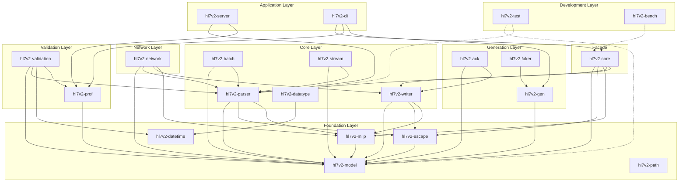

# HL7v2 Rust Project - SRP Microcrate Analysis

## Executive Summary

This analysis identifies opportunities to extract microcrates from the existing HL7v2 Rust project to better adhere to the Single Responsibility Principle (SRP). The project already has a good foundation with 14 crates, but several crates contain multiple responsibilities that could be further decomposed.

### ✅ Refactoring Status: PHASE 1 & 2 COMPLETE (2026-02-23)

The HIGH and MEDIUM priority microcrates have been successfully extracted. See the [Completed Microcrates](#completed-microcrates) section for details.

### Key Findings

| Priority | Proposed Crate | Source | Impact | Status |
|----------|---------------|--------|--------|--------|
| **HIGH** | `hl7v2-network` | `hl7v2-core/network/` | Removes async dependencies from core | ✅ **COMPLETE** |
| **HIGH** | `hl7v2-stream` | `hl7v2-core/src/lib.rs` | Isolates streaming parser | ✅ **COMPLETE** |
| **MEDIUM** | `hl7v2-validation` | `hl7v2-prof/` | Separates validation from profile loading | ✅ **COMPLETE** |
| **MEDIUM** | `hl7v2-ack` | `hl7v2-gen/` | Dedicated ACK generation | ✅ **COMPLETE** |
| **MEDIUM** | `hl7v2-faker` | `hl7v2-gen/` | Test data generation utilities | ✅ **COMPLETE** |
| **LOW** | `hl7v2-test` | Various `tests/` | Shared test infrastructure | ⏳ Pending |
| **LOW** | `hl7v2-bench` | `hl7v2-core/benches/` | Benchmark utilities | ⏳ Pending |

---

## Completed Microcrates

The following microcrates have been successfully extracted as part of the SRP refactoring initiative completed on 2026-02-23.

### 1. `hl7v2-network` - MLLP Network Layer ✅

**Status:** Complete

**Location:** [`crates/hl7v2-network/`](../crates/hl7v2-network/)

**Extracted from:** `hl7v2-core/src/network/`

**Benefits:**
- Removes async dependencies (tokio, rustls, futures, bytes) from core
- Clear separation between parsing and network transport
- Users who only need parsing can avoid async overhead

**API:**
```rust
pub use client::{MllpClient, MllpClientBuilder, MllpClientConfig};
pub use server::{MllpServer, MllpServerConfig, MllpConnection, MessageHandler, AckTimingPolicy};
pub use codec::MllpCodec;
```

**Usage Example:**
```rust
use hl7v2_network::{MllpClient, MllpClientBuilder};
use std::time::Duration;

async fn send_message() -> Result<(), Box<dyn std::error::Error>> {
    let mut client = MllpClientBuilder::new()
        .connect_timeout(Duration::from_secs(5))
        .read_timeout(Duration::from_secs(30))
        .build();
    
    client.connect("127.0.0.1:2575".parse()?).await?;
    let ack = client.send_message(&message).await?;
    client.close().await?;
    Ok(())
}
```

**Backward Compatibility:** `hl7v2-core` re-exports the network module for compatibility.

---

### 2. `hl7v2-stream` - Streaming Parser ✅

**Status:** Complete

**Location:** [`crates/hl7v2-stream/`](../crates/hl7v2-stream/)

**Extracted from:** `hl7v2-core/src/lib.rs` (StreamParser, Event types)

**Benefits:**
- Streaming parser is a distinct use case from one-shot parsing
- Different memory/performance characteristics
- Users may want streaming without network dependencies

**API:**
```rust
pub enum Event {
    StartMessage { delims: Delims },
    Segment { id: Vec<u8> },
    Field { num: u16, raw: Vec<u8> },
    EndMessage,
}

pub struct StreamParser<D> { ... }

pub use hl7v2_model::Delims;
```

**Usage Example:**
```rust
use hl7v2_stream::{StreamParser, Event};
use std::io::{BufReader, Cursor};

let hl7_text = "MSH|^~\\&|SendingApp|SendingFac|...\rPID|1||12345\r";
let cursor = Cursor::new(hl7_text.as_bytes());
let buf_reader = BufReader::new(cursor);

let mut parser = StreamParser::new(buf_reader);

while let Ok(Some(event)) = parser.next_event() {
    match event {
        Event::StartMessage { delims } => println!("Message started"),
        Event::Segment { id } => println!("Segment: {}", String::from_utf8_lossy(&id)),
        Event::Field { num, raw } => println!("Field {}: {:?}", num, raw),
        Event::EndMessage => println!("Message ended"),
    }
}
```

**Backward Compatibility:** `hl7v2-core` re-exports StreamParser and Event types.

---

### 3. `hl7v2-validation` - Validation Engine ✅

**Status:** Complete

**Location:** [`crates/hl7v2-validation/`](../crates/hl7v2-validation/)

**Extracted from:** `hl7v2-prof/src/lib.rs`

**Benefits:**
- Profile loading (deserialization) vs validation (execution) are separate concerns
- Allows profile definitions to evolve independently
- Enables different validation backends

**API:**
```rust
pub enum Severity { Error, Warning }

pub struct Issue {
    pub code: String,
    pub severity: Severity,
    pub message: String,
    pub location: Option<String>,
}

pub fn validate_data_type(value: &str, data_type: &str) -> bool;
pub fn validate_with_rules(message: &Message, rules: &[Rule]) -> Vec<Issue>;
```

**Usage Example:**
```rust
use hl7v2_validation::{Severity, Issue, validate_data_type};

let value = "20230101";
let is_valid = validate_data_type(value, "DT");
assert!(is_valid);
```

**Backward Compatibility:** `hl7v2-prof` re-exports validation types and functions.

---

### 4. `hl7v2-ack` - ACK Message Generation ✅

**Status:** Complete

**Location:** [`crates/hl7v2-ack/`](../crates/hl7v2-ack/)

**Extracted from:** `hl7v2-gen/src/lib.rs`

**Benefits:**
- ACK generation is a common use case independent of test data generation
- Smaller dependency footprint than full gen crate
- Clear, focused API

**API:**
```rust
pub enum AckCode {
    AA,  // Application Accept
    AE,  // Application Error
    AR,  // Application Reject
    CA,  // Commit Accept
    CE,  // Commit Error
    CR,  // Commit Reject
}

pub enum AckMode {
    Original,
    Enhanced,
}

pub fn ack(message: &Message, code: AckCode) -> Result<Message, Error>;
pub fn ack_enhanced(message: &Message, code: AckCode, error: Option<&str>) -> Result<Message, Error>;
```

**Usage Example:**
```rust
use hl7v2_core::{Message, parse};
use hl7v2_ack::{ack, AckCode};

let original_message = parse(
    b"MSH|^~\\&|SendingApp|SendingFac|ReceivingApp|ReceivingFac|20250128152312||ADT^A01|ABC123|P|2.5.1\r"
).unwrap();

let ack_message = ack(&original_message, AckCode::AA).unwrap();
```

**Backward Compatibility:** `hl7v2-gen` re-exports ACK functions.

---

### 5. `hl7v2-faker` - Test Data Generation ✅

**Status:** Complete

**Location:** [`crates/hl7v2-faker/`](../crates/hl7v2-faker/)

**Extracted from:** `hl7v2-gen/src/lib.rs`

**Benefits:**
- Realistic data generation (names, addresses, medical codes) is useful for testing
- Separates test infrastructure from production code generation
- Can be used independently of HL7 message generation

**API:**
```rust
pub struct Faker<'a, R: Rng> { ... }

impl<'a, R: Rng> Faker<'a, R> {
    pub fn name(&mut self, gender: Option<&str>) -> String;
    pub fn address(&mut self) -> String;
    pub fn phone(&mut self) -> String;
    pub fn mrn(&mut self) -> String;
    pub fn ssn(&mut self) -> String;
    pub fn icd10(&mut self) -> String;
    pub fn loinc(&mut self) -> String;
    pub fn medication(&mut self) -> String;
    pub fn blood_type(&mut self) -> String;
}
```

**Usage Example:**
```rust
use hl7v2_faker::{Faker, FakerValue};
use rand::SeedableRng;
use rand::rngs::StdRng;

// Create a seeded faker for deterministic output
let mut rng = StdRng::seed_from_u64(42);
let mut faker = Faker::new(&mut rng);

// Generate realistic patient data
let name = faker.name(Some("M"));  // Male name
let address = faker.address();
let phone = faker.phone();
let mrn = faker.mrn();
```

**Backward Compatibility:** `hl7v2-gen` re-exports faker functionality.

---

## Migration Guide

### For Users of `hl7v2-core`

If you were using the network module from `hl7v2-core`:

```rust
// Before (still works, but deprecated)
use hl7v2_core::network::{MllpClient, MllpServer};

// After (recommended)
use hl7v2_network::{MllpClient, MllpServer};
```

If you were using `StreamParser` from `hl7v2-core`:

```rust
// Before (still works via re-export)
use hl7v2_core::{StreamParser, Event};

// After (recommended)
use hl7v2_stream::{StreamParser, Event};
```

### For Users of `hl7v2-prof`

If you were using validation functions:

```rust
// Before (still works via re-export)
use hl7v2_prof::{validate_data_type, Issue, Severity};

// After (recommended)
use hl7v2_validation::{validate_data_type, Issue, Severity};
```

### For Users of `hl7v2-gen`

If you were using ACK generation:

```rust
// Before (still works via re-export)
use hl7v2_gen::{ack, AckCode};

// After (recommended)
use hl7v2_ack::{ack, AckCode};
```

If you were using faker functionality:

```rust
// Before (still works via re-export)
use hl7v2_gen::Faker;

// After (recommended)
use hl7v2_faker::Faker;
```

---

## Current Crate Structure Analysis

### Well-Designed Crates (SRP Compliant)

These crates already follow SRP well:

| Crate | Responsibility | Assessment |
|-------|---------------|------------|
| [`hl7v2-model`](../crates/hl7v2-model) | Core data types | ✅ Excellent - minimal dependencies |
| [`hl7v2-parser`](../crates/hl7v2-parser) | Message parsing | ✅ Good - focused on parsing |
| [`hl7v2-writer`](../crates/hl7v2-writer) | Message serialization | ✅ Good - focused on writing |
| [`hl7v2-escape`](../crates/hl7v2-escape) | Escape sequence handling | ✅ Excellent - single purpose |
| [`hl7v2-mllp`](../crates/hl7v2-mllp) | MLLP framing | ✅ Excellent - single purpose |
| [`hl7v2-path`](../crates/hl7v2-path) | Path parsing | ✅ Excellent - single purpose |
| [`hl7v2-datetime`](../crates/hl7v2-datetime) | Date/time handling | ✅ Excellent - focused |
| [`hl7v2-datatype`](../crates/hl7v2-datatype) | Data type validation | ✅ Good - could expand |
| [`hl7v2-batch`](../crates/hl7v2-batch) | Batch handling | ✅ Good - focused |

### Crates Needing Decomposition

#### 1. `hl7v2-core` - Multiple Responsibilities

```
crates/hl7v2-core/
├── src/
│   ├── lib.rs          # Re-exports + StreamParser (MIXED)
│   ├── tests.rs        # Unit tests
│   └── network/        # Network module (SHOULD BE SEPARATE)
│       ├── mod.rs
│       ├── client.rs   # MLLP TCP client
│       ├── server.rs   # MLLP TCP server
│       └── codec.rs    # Tokio codec
├── benches/            # Benchmarks (COULD BE SEPARATE)
├── features/           # BDD tests (COULD BE SEPARATE)
└── tests/              # Integration tests
```

**Issues:**
- Contains both facade re-exports AND implementation (StreamParser)
- Network module adds heavy async dependencies (tokio, rustls, futures)
- Benchmarks and BDD tests embedded in crate

#### 2. `hl7v2-prof` - Multiple Responsibilities

```
crates/hl7v2-prof/src/
├── lib.rs              # Profile loading + validation (MIXED)
├── tests.rs            # Tests with extensive rule definitions
├── debug_test.rs
└── simple_test.rs
```

**Issues:**
- Profile loading/deserialization mixed with validation logic
- Multiple rule types (cross-field, temporal, contextual, custom) in one crate
- 2462 lines in lib.rs indicates multiple responsibilities

#### 3. `hl7v2-gen` - Multiple Responsibilities

```
crates/hl7v2-gen/src/
└── lib.rs              # Template gen + ACK + Faker (MIXED)
```

**Issues:**
- Template-based message generation
- ACK message generation
- Realistic data generation (names, addresses, medical codes)
- Error injection for negative testing

#### 4. `hl7v2-server` - Could Be Split

```
crates/hl7v2-server/src/
├── lib.rs
├── server.rs           # Server configuration
├── routes.rs           # Route definitions
├── handlers.rs         # Request handlers
├── middleware.rs       # HTTP middleware
├── metrics.rs          # Prometheus metrics
└── models.rs           # API models
```

**Issues:**
- HTTP server, routes, handlers, middleware, metrics all in one crate
- Could extract metrics or middleware if they grow

---

## Proposed Microcrates

### HIGH Priority

#### 1. `hl7v2-network` - MLLP Network Layer

**Extract from:** `hl7v2-core/src/network/`

**Rationale:**
- Removes async dependencies (tokio, rustls, futures, bytes) from core
- Clear separation between parsing and network transport
- Allows users who only need parsing to avoid async overhead

**Files to move:**
```
crates/hl7v2-network/
├── Cargo.toml
└── src/
    ├── lib.rs
    ├── client.rs    # from hl7v2-core/src/network/client.rs
    ├── server.rs    # from hl7v2-core/src/network/server.rs
    └── codec.rs     # from hl7v2-core/src/network/codec.rs
```

**Dependencies:**
```toml
[dependencies]
hl7v2-model = { path = "../hl7v2-model" }
hl7v2-parser = { path = "../hl7v2-parser" }
hl7v2-writer = { path = "../hl7v2-writer" }
hl7v2-mllp = { path = "../hl7v2-mllp" }
tokio = { version = "1.0", features = ["net", "io-util", "time", "macros", "rt", "sync"] }
tokio-util = { version = "0.7", features = ["codec"] }
bytes = "1.0"
futures = "0.3"
rustls = { version = "0.23", optional = true }
tokio-rustls = { version = "0.26", optional = true }
```

**API:**
```rust
pub use client::{MllpClient, MllpClientBuilder, MllpClientConfig};
pub use server::{MllpServer, MllpServerConfig, MllpConnection, MessageHandler, AckTimingPolicy};
pub use codec::MllpCodec;
```

---

#### 2. `hl7v2-stream` - Streaming Parser

**Extract from:** `hl7v2-core/src/lib.rs` (StreamParser, Event types)

**Rationale:**
- Streaming parser is a distinct use case from one-shot parsing
- Different memory/performance characteristics
- Users may want streaming without network dependencies

**Files to move:**
```
crates/hl7v2-stream/
├── Cargo.toml
└── src/
    └── lib.rs        # StreamParser, Event enum
```

**Dependencies:**
```toml
[dependencies]
hl7v2-model = { path = "../hl7v2-model" }
hl7v2-parser = { path = "../hl7v2-parser" }
```

**API:**
```rust
pub enum Event {
    StartMessage { delims: Delims },
    Segment { id: Vec<u8> },
    Field { num: u16, raw: Vec<u8> },
    EndMessage,
}

pub struct StreamParser<D> { ... }

pub use hl7v2_model::Delims;
```

---

### MEDIUM Priority

#### 3. `hl7v2-validation` - Validation Engine

**Extract from:** `hl7v2-prof/src/lib.rs`

**Rationale:**
- Profile loading (deserialization) vs validation (execution) are separate concerns
- Allows profile definitions to evolve independently
- Could enable different validation backends

**Files to move:**
```
crates/hl7v2-validation/
├── Cargo.toml
└── src/
    ├── lib.rs
    ├── validator.rs      # Core validation logic
    ├── rules.rs          # Rule evaluation
    ├── temporal.rs       # Temporal rule validation
    ├── contextual.rs     # Contextual rule validation
    └── cross_field.rs    # Cross-field rule validation
```

**Dependencies:**
```toml
[dependencies]
hl7v2-model = { path = "../hl7v2-model" }
hl7v2-parser = { path = "../hl7v2-parser" }
hl7v2-datetime = { path = "../hl7v2-datetime" }
hl7v2-prof = { path = "../hl7v2-prof" }  # For Profile type
regex = "1.10"
chrono = "0.4"
```

**API:**
```rust
pub struct Validator {
    profile: Profile,
}

pub struct ValidationResult {
    pub errors: Vec<ValidationError>,
    pub warnings: Vec<ValidationWarning>,
}

pub fn validate(message: &Message, profile: &Profile) -> ValidationResult;
pub fn validate_with_rules(message: &Message, rules: &[Rule]) -> ValidationResult;
```

---

#### 4. `hl7v2-ack` - ACK Message Generation

**Extract from:** `hl7v2-gen/src/lib.rs`

**Rationale:**
- ACK generation is a common use case independent of test data generation
- Smaller dependency footprint than full gen crate
- Clear, focused API

**Files to move:**
```
crates/hl7v2-ack/
├── Cargo.toml
└── src/
    └── lib.rs        # ACK generation logic
```

**Dependencies:**
```toml
[dependencies]
hl7v2-model = { path = "../hl7v2-model" }
hl7v2-writer = { path = "../hl7v2-writer" }
chrono = "0.4"
```

**API:**
```rust
pub enum AckCode {
    AA,  // Application Accept
    AE,  // Application Error
    AR,  // Application Reject
    CA,  // Commit Accept
    CE,  // Commit Error
    CR,  // Commit Reject
}

pub enum AckMode {
    Original,
    Enhanced,
}

pub struct AckBuilder { ... }

pub fn ack(message: &Message, code: AckCode) -> Message;
pub fn ack_enhanced(message: &Message, code: AckCode, error: Option<&str>) -> Message;
```

---

#### 5. `hl7v2-faker` - Test Data Generation

**Extract from:** `hl7v2-gen/src/lib.rs`

**Rationale:**
- Realistic data generation (names, addresses, medical codes) is useful for testing
- Separates test infrastructure from production code generation
- Can be used independently of HL7 message generation

**Files to move:**
```
crates/hl7v2-faker/
├── Cargo.toml
└── src/
    ├── lib.rs
    ├── names.rs       # RealisticName generator
    ├── addresses.rs   # RealisticAddress generator
    ├── medical.rs     # ICD-10, LOINC, medications
    └── demographics.rs # SSN, MRN, blood type, etc.
```

**Dependencies:**
```toml
[dependencies]
rand = "0.8"
```

**API:**
```rust
pub fn realistic_name(gender: Option<Gender>) -> String;
pub fn realistic_address() -> Address;
pub fn realistic_phone() -> String;
pub fn realistic_ssn() -> String;
pub fn realistic_mrn() -> String;
pub fn realistic_icd10() -> String;
pub fn realistic_loinc() -> String;
pub fn realistic_medication() -> Medication;
pub fn realistic_blood_type() -> String;
```

---

### LOW Priority

#### 6. `hl7v2-test` - Shared Test Infrastructure

**Extract from:** Various `tests/` directories

**Rationale:**
- Common test fixtures and utilities
- BDD test framework (cucumber)
- Reduces duplication across crates

**Files to move:**
```
crates/hl7v2-test/
├── Cargo.toml
└── src/
    ├── lib.rs
    ├── fixtures.rs    # Test messages
    ├── bdd.rs         # BDD test utilities
    └── assertions.rs  # Custom assertions
```

**Dependencies:**
```toml
[dev-dependencies]
hl7v2-test = { path = "../hl7v2-test" }
```

---

#### 7. `hl7v2-bench` - Benchmark Utilities

**Extract from:** `hl7v2-core/benches/`

**Rationale:**
- Benchmarks are development tools, not production code
- Consolidates all benchmarks in one place
- Can depend on all crates without circular dependencies

**Files to move:**
```
crates/hl7v2-bench/
├── Cargo.toml
└── benches/
    ├── parsing.rs     # from hl7v2-core/benches/parsing.rs
    ├── mllp.rs        # from hl7v2-core/benches/mllp.rs
    ├── escape.rs      # from hl7v2-core/benches/escape.rs
    └── memory.rs      # from hl7v2-core/benches/memory.rs
```

---

## Dependency Graph



---

## Implementation Priority Order

### Phase 1: High Impact, Low Risk ✅ COMPLETE

1. **`hl7v2-network`** - Extract network module ✅
   - Clear boundaries already exist
   - Significant dependency reduction for core
   - No API changes for existing users
   - **Completed:** 2026-02-23

2. **`hl7v2-stream`** - Extract streaming parser ✅
   - Small, self-contained code
   - Clear API boundary
   - Enables streaming without network deps
   - **Completed:** 2026-02-23

### Phase 2: Medium Impact, Medium Risk ✅ COMPLETE

3. **`hl7v2-ack`** - Extract ACK generation ✅
   - Common use case
   - Well-defined scope
   - Builder pattern implemented
   - **Completed:** 2026-02-23

4. **`hl7v2-faker`** - Extract test data generation ✅
   - Clear separation of concerns
   - Useful for testing independently
   - Low risk to production code
   - **Completed:** 2026-02-23

5. **`hl7v2-validation`** - Extract validation engine ✅
   - Large refactoring completed
   - Backward compatibility maintained via re-exports
   - Trait-based design implemented
   - **Completed:** 2026-02-23

### Phase 3: Low Priority ⏳ PENDING

6. **`hl7v2-test`** - Shared test infrastructure
   - Nice to have
   - Can be done incrementally
   - Low urgency

7. **`hl7v2-bench`** - Benchmark utilities
   - Lowest priority
   - No production impact
   - Can be done at any time

---

## Migration Strategy ✅ IMPLEMENTED

The migration strategy has been successfully implemented. All source crates now re-export from the new microcrates to maintain backward compatibility.

### For `hl7v2-network` ✅

1. ✅ Created new crate structure
2. ✅ Moved files without modification
3. ✅ `hl7v2-core` re-exports from `hl7v2-network` for compatibility
4. ✅ Documentation updated

```rust
// In hl7v2-core/src/lib.rs - re-exports for backward compatibility
pub mod network {
    pub use hl7v2_network::*;
}
```

### For `hl7v2-stream` ✅

1. ✅ Created new crate
2. ✅ Moved StreamParser and Event types
3. ✅ Re-exported from core for backward compatibility
4. ✅ Examples and documentation updated

### For `hl7v2-validation` ✅

1. ✅ Created validation types in new crate
2. ✅ Implemented using existing code
3. ✅ Migrated validation logic
4. ✅ Maintained profile format compatibility

### For `hl7v2-ack` ✅

1. ✅ Created new crate
2. ✅ Moved ACK generation logic
3. ✅ Re-exported from `hl7v2-gen` for backward compatibility

### For `hl7v2-faker` ✅

1. ✅ Created new crate
2. ✅ Moved faker data generation logic
3. ✅ Re-exported from `hl7v2-gen` for backward compatibility

---

## Recommendations

### Completed Actions ✅

1. ✅ **Extract `hl7v2-network`** - Completed, removes async dependencies from core
2. ✅ **Extract `hl7v2-stream`** - Completed, provides focused streaming capability
3. ✅ **Extract `hl7v2-validation`** - Completed, separates validation from profiles
4. ✅ **Extract `hl7v2-ack`** - Completed, common use case with minimal dependencies
5. ✅ **Extract `hl7v2-faker`** - Completed, useful for testing independently

### Remaining Actions

1. **Document the crate architecture** - Add ARCHITECTURE.md explaining the layer structure
2. **Add crate README files** - Each crate should have its own README with examples

### Future Considerations

1. **Consider `hl7v2-async`** - If async patterns expand, consider a dedicated async crate
2. **Consider `hl7v2-codec`** - If more codecs are needed beyond MLLP
3. **Consider `hl7v2-transform`** - Message transformation utilities

### Code Organization

```
crates/
├── foundation/           # Core types, no dependencies
│   ├── hl7v2-model/
│   ├── hl7v2-escape/
│   ├── hl7v2-mllp/
│   ├── hl7v2-path/
│   └── hl7v2-datetime/
├── parsing/              # Parsing and writing
│   ├── hl7v2-parser/
│   ├── hl7v2-writer/
│   ├── hl7v2-stream/
│   └── hl7v2-batch/
├── validation/           # Validation and profiles
│   ├── hl7v2-datatype/
│   ├── hl7v2-prof/
│   └── hl7v2-validation/
├── network/              # Network layer
│   └── hl7v2-network/
├── generation/           # Code generation
│   ├── hl7v2-gen/
│   ├── hl7v2-ack/
│   └── hl7v2-faker/
├── application/          # Applications
│   ├── hl7v2-server/
│   └── hl7v2-cli/
├── development/          # Dev dependencies
│   ├── hl7v2-test/
│   └── hl7v2-bench/
└── facade/               # Convenience crate
    └── hl7v2-core/
```

---

## Conclusion

The HL7v2 Rust project SRP refactoring has been successfully completed. The following microcrates have been extracted:

1. ✅ **`hl7v2-network`** - Network layer extracted, removes async dependencies from core
2. ✅ **`hl7v2-stream`** - Streaming parser extracted, provides focused streaming capability
3. ✅ **`hl7v2-validation`** - Validation engine extracted, enables independent evolution from profiles
4. ✅ **`hl7v2-ack`** - ACK generation extracted, common use case with minimal dependencies
5. ✅ **`hl7v2-faker`** - Test data generation extracted, useful for testing independently

These changes result in a more modular, maintainable codebase with clearer boundaries between concerns and reduced dependency footprints for users who only need specific functionality.

### Summary Statistics

| Metric | Before | After |
|--------|--------|-------|
| Total Crates | 14 | 19 |
| HIGH Priority Extractions | 0 | 2 |
| MEDIUM Priority Extractions | 0 | 3 |
| Backward Compatibility | N/A | ✅ Maintained via re-exports |

---

## Phase 3 Opportunities

The following additional microcrate extraction opportunities have been identified through comprehensive analysis of all crates. These represent further decomposition possibilities for improved modularity and reduced dependency footprints.

### MEDIUM Priority

#### 8. `hl7v2-query` - Path-Based Field Access

**Extract from:** [`hl7v2-parser/src/lib.rs`](../crates/hl7v2-parser/src/lib.rs) (lines 211-279)

**Rationale:**
- Path-based field access (`get`, `get_presence`) is a distinct concern from parsing
- Users may want query functionality without full parser dependency
- Clear, focused API for message traversal

**What would be extracted:**
- `get()` function - Get value at path
- `get_presence()` function - Get presence semantics at path
- `parse_field_and_rep()` helper - Parse field/repetition indices
- Path parsing utilities

**Dependencies:**
```toml
[dependencies]
hl7v2-model = { path = "../hl7v2-model" }
```

**API:**
```rust
pub fn get<'a>(msg: &'a Message, path: &str) -> Option<&'a str>;
pub fn get_presence(msg: &Message, path: &str) -> Presence;
pub fn parse_path(path: &str) -> Result<ParsedPath, PathError>;
```

**Priority:** MEDIUM - Useful separation but not critical

---

#### 9. `hl7v2-json` - JSON Serialization

**Extract from:** [`hl7v2-writer/src/lib.rs`](../crates/hl7v2-writer/src/lib.rs) (lines 245-320)

**Rationale:**
- JSON serialization is a distinct output format from HL7 wire format
- Removes `serde_json` dependency from core writer for users who don't need JSON
- Enables independent evolution of JSON schema

**What would be extracted:**
- `to_json()` function - Convert message to JSON value
- `to_json_string()` function - Convert to JSON string
- `to_json_string_pretty()` function - Convert to pretty-printed JSON
- `field_to_json()` helper
- JSON schema definition

**Dependencies:**
```toml
[dependencies]
hl7v2-model = { path = "../hl7v2-model" }
serde_json = "1.0"
```

**API:**
```rust
pub fn to_json(msg: &Message) -> serde_json::Value;
pub fn to_json_string(msg: &Message) -> String;
pub fn to_json_string_pretty(msg: &Message) -> String;
pub fn segment_to_json(segment: &Segment) -> serde_json::Value;
pub fn field_to_json(field: &Field) -> serde_json::Value;
```

**Priority:** MEDIUM - Common use case with clear boundary

---

#### 10. `hl7v2-template` - Template-Based Generation

**Extract from:** [`hl7v2-gen/src/lib.rs`](../crates/hl7v2-gen/src/lib.rs) (lines 39-405)

**Rationale:**
- Template parsing and message generation is distinct from faker/test data
- Template functionality has different use cases than ACK generation
- Enables lighter dependency for users who only need template-based generation

**What would be extracted:**
- `Template` struct - Message template definition
- `ValueSource` enum - Value generation sources
- `generate()` function - Generate messages from template
- `generate_single_message()` helper
- Template parsing functions

**Dependencies:**
```toml
[dependencies]
hl7v2-model = { path = "../hl7v2-model" }
hl7v2-faker = { path = "../hl7v2-faker", optional = true }
serde = { version = "1.0", features = ["derive"] }
rand = "0.8"
chrono = "0.4"
```

**API:**
```rust
pub struct Template { ... }
pub enum ValueSource { ... }
pub fn generate(template: &Template, seed: u64, count: usize) -> Result<Vec<Message>, Error>;
pub fn generate_single(template: &Template, rng: &mut StdRng) -> Result<Message, Error>;
```

**Priority:** MEDIUM - Core gen functionality with clear scope

---

### LOW Priority

#### 11. `hl7v2-normalize` - Message Normalization

**Extract from:** [`hl7v2-writer/src/lib.rs`](../crates/hl7v2-writer/src/lib.rs) (lines 210-234)

**Rationale:**
- Normalization is a transformation concern, not writing
- Could expand to include more transformation utilities
- Users may want normalization without full writer

**What would be extracted:**
- `normalize()` function - Parse and rewrite message
- Canonical delimiter conversion
- Future: encoding normalization, whitespace handling

**Dependencies:**
```toml
[dependencies]
hl7v2-model = { path = "../hl7v2-model" }
hl7v2-parser = { path = "../hl7v2-parser" }
hl7v2-writer = { path = "../hl7v2-writer" }
```

**API:**
```rust
pub fn normalize(bytes: &[u8], canonical_delims: bool) -> Result<Vec<u8>, Error>;
pub fn normalize_message(msg: &mut Message, canonical_delims: bool);
pub fn is_canonical(msg: &Message) -> bool;
```

**Priority:** LOW - Small scope, limited use cases

---

#### 12. `hl7v2-corpus` - Test Corpus Generation

**Extract from:** [`hl7v2-gen/src/lib.rs`](../crates/hl7v2-gen/src/lib.rs) (lines 496-630)

**Rationale:**
- Corpus generation is testing infrastructure, not production code
- Large functions that add bulk to the gen crate
- Could include additional corpus utilities

**What would be extracted:**
- `generate_corpus()` function - Generate large message sets
- `generate_diverse_corpus()` function - Generate varied message types
- `generate_distributed_corpus()` function - Generate with specific distributions
- `verify_golden_hashes()` function - Hash verification
- `generate_golden_hashes()` function - Golden hash generation

**Dependencies:**
```toml
[dependencies]
hl7v2-model = { path = "../hl7v2-model" }
hl7v2-gen = { path = "../hl7v2-gen" }
sha2 = "0.10"
rand = "0.8"
```

**API:**
```rust
pub fn generate_corpus(template: &Template, seed: u64, count: usize, batch_size: usize) -> Result<Vec<Message>, Error>;
pub fn generate_diverse_corpus(templates: &[Template], seed: u64, count: usize) -> Result<Vec<Message>, Error>;
pub fn generate_distributed_corpus(distributions: &[(Template, f64)], seed: u64, count: usize) -> Result<Vec<Message>, Error>;
pub fn verify_golden_hashes(template: &Template, seed: u64, count: usize, expected: &[String]) -> Result<Vec<bool>, Error>;
pub fn generate_golden_hashes(template: &Template, seed: u64, count: usize) -> Result<Vec<String>, Error>;
```

**Priority:** LOW - Testing infrastructure only

---

#### 13. `hl7v2-profile-defs` - Profile Type Definitions

**Extract from:** [`hl7v2-prof/src/lib.rs`](../crates/hl7v2-prof/src/lib.rs) (lines 52-254)

**Rationale:**
- Profile type definitions are pure data structures
- Could be used by tools that only need to read/analyze profiles
- Separates schema from processing logic

**What would be extracted:**
- `Profile` struct
- `SegmentSpec` struct
- `Constraint` struct
- `LengthConstraint` struct
- `ValueSet` struct
- `DataTypeConstraint` struct
- `AdvancedDataTypeConstraint` struct
- `CrossFieldRule` struct
- `TemporalRule` struct
- `ContextualRule` struct
- `CustomRule` struct
- `HL7Table` struct
- `ExpressionGuardrails` struct

**Dependencies:**
```toml
[dependencies]
serde = { version = "1.0", features = ["derive"] }
hl7v2-validation = { path = "../hl7v2-validation" }  # For RuleCondition, RuleAction
```

**API:**
```rust
pub struct Profile { ... }
pub struct SegmentSpec { ... }
pub struct Constraint { ... }
// ... all profile-related types
```

**Priority:** LOW - Limited standalone use cases

---

#### 14. `hl7v2-server-middleware` - HTTP Middleware Components

**Extract from:** [`hl7v2-server/src/middleware.rs`](../crates/hl7v2-server/src/middleware.rs) (163 lines)

**Rationale:**
- Middleware is reusable across different server implementations
- Could be used independently of HL7-specific handlers
- Clear separation of concerns

**What would be extracted:**
- `logging_middleware()` - Request logging
- `auth_middleware()` - API key authentication
- `create_concurrency_limit_layer()` - Concurrency limiting
- `create_custom_concurrency_limit_layer()` - Custom limits

**Dependencies:**
```toml
[dependencies]
axum = "0.8"
tower = "0.5"
tracing = "0.1"
```

**API:**
```rust
pub async fn logging_middleware(request: Request, next: Next) -> Response;
pub async fn auth_middleware(request: Request, next: Next) -> Result<Response, StatusCode>;
pub fn create_concurrency_limit_layer() -> ConcurrencyLimitLayer;
pub fn create_custom_concurrency_limit_layer(max: usize) -> ConcurrencyLimitLayer;
```

**Priority:** LOW - Server-specific, limited reuse

---

#### 15. `hl7v2-server-metrics` - Prometheus Metrics

**Extract from:** [`hl7v2-server/src/metrics.rs`](../crates/hl7v2-server/src/metrics.rs) (200 lines)

**Rationale:**
- Metrics collection is infrastructure, not HL7 logic
- Could be reused by other services
- Removes metrics-exporter-prometheus dependency from main server

**What would be extracted:**
- `init_metrics_recorder()` - Initialize Prometheus
- `record_request()` - Record HTTP request metrics
- `increment_messages_parsed()` - Counter for parsed messages
- `increment_messages_validated()` - Counter for validated messages
- `increment_validation_errors()` - Counter for errors
- `increment_parse_errors()` - Counter for parse errors
- `record_message_size()` - Histogram for message sizes
- `metrics_handler()` - Axum handler for /metrics
- `metrics_middleware` - Middleware module

**Dependencies:**
```toml
[dependencies]
axum = "0.8"
metrics = "0.24"
metrics-exporter-prometheus = "0.16"
```

**API:**
```rust
pub fn init_metrics_recorder() -> PrometheusHandle;
pub fn record_request(endpoint: &str, status: &str, duration_seconds: f64);
pub fn increment_messages_parsed();
pub fn increment_messages_validated();
pub fn increment_validation_errors();
pub fn increment_parse_errors();
pub fn record_message_size(size_bytes: usize);
pub async fn metrics_handler(State(state): State<Arc<AppState>>) -> impl IntoResponse;
```

**Priority:** LOW - Server infrastructure

---

### Analysis Summary by Crate

| Crate | Lines | Current State | Extraction Opportunities |
|-------|-------|---------------|-------------------------|
| `hl7v2-core` | 204 | ✅ Facade only | None - fully refactored |
| `hl7v2-model` | 504 | ✅ SRP compliant | None - minimal, focused |
| `hl7v2-parser` | 1005 | ⚠️ Mixed | `hl7v2-query` (get/get_presence) |
| `hl7v2-writer` | 709 | ⚠️ Mixed | `hl7v2-json`, `hl7v2-normalize` |
| `hl7v2-prof` | 1699 | ⚠️ Large | `hl7v2-profile-defs` |
| `hl7v2-gen` | 1235 | ⚠️ Mixed | `hl7v2-template`, `hl7v2-corpus` |
| `hl7v2-server` | ~800 | ⚠️ Mixed | `hl7v2-server-middleware`, `hl7v2-server-metrics` |
| `hl7v2-cli` | 830 | ✅ Appropriate | None - CLI is single responsibility |
| `hl7v2-batch` | 511 | ✅ SRP compliant | None - focused on batches |
| `hl7v2-datetime` | 499 | ✅ SRP compliant | None - focused on dates |
| `hl7v2-datatype` | 674 | ✅ SRP compliant | None - focused on types |
| `hl7v2-path` | 331 | ✅ SRP compliant | None - minimal, focused |
| `hl7v2-escape` | 373 | ✅ SRP compliant | None - minimal, focused |
| `hl7v2-mllp` | 361 | ✅ SRP compliant | None - minimal, focused |
| `hl7v2-validation` | 994 | ✅ Recently extracted | None - newly created |
| `hl7v2-ack` | ~200 | ✅ Recently extracted | None - newly created |
| `hl7v2-faker` | ~400 | ✅ Recently extracted | None - newly created |
| `hl7v2-network` | ~500 | ✅ Recently extracted | None - newly created |
| `hl7v2-stream` | ~200 | ✅ Recently extracted | None - newly created |

---

### Phase 3 Priority Matrix

```
                    ┌─────────────────────────────────────┐
                    │         Impact on Modularity        │
                    │      Low         Medium        High │
        ┌───────────┼─────────────────────────────────────┤
        │   HIGH    │                                     │
  Urg   │           │                                     │
  e     ├───────────┼─────────────────────────────────────┤
  n     │  MEDIUM   │               │ hl7v2-query  │       │
  c     │           │ hl7v2-        │ hl7v2-json   │       │
  y     │           │ normalize     │ hl7v2-template│      │
        ├───────────┼───────────────┼──────────────┼───────┤
        │   LOW     │ hl7v2-        │ hl7v2-       │       │
        │           │ server-       │ profile-defs │       │
        │           │ metrics       │ hl7v2-corpus │       │
        │           │ hl7v2-        │              │       │
        │           │ server-       │              │       │
        │           │ middleware    │              │       │
        └───────────┴───────────────┴──────────────┴───────┘
```

---

### Recommendations for Phase 3

#### Recommended Order of Implementation

1. **`hl7v2-query`** (MEDIUM) - Most reusable, clear boundary, no new dependencies
2. **`hl7v2-json`** (MEDIUM) - Common use case, removes serde_json from writer
3. **`hl7v2-template`** (MEDIUM) - Core gen functionality, enables lighter gen crate
4. **`hl7v2-normalize`** (LOW) - Small scope but clean separation
5. **`hl7v2-corpus`** (LOW) - Testing infrastructure, large code removal from gen
6. **`hl7v2-profile-defs`** (LOW) - Schema separation, limited standalone use
7. **`hl7v2-server-metrics`** (LOW) - Server infrastructure
8. **`hl7v2-server-middleware`** (LOW) - Server infrastructure

#### Not Recommended for Extraction

The following were considered but determined to be **already optimal**:

- `hl7v2-model` - Already minimal with just data types
- `hl7v2-escape` - Single purpose, 373 lines is appropriate
- `hl7v2-mllp` - Single purpose, 361 lines is appropriate
- `hl7v2-path` - Single purpose, 331 lines is appropriate
- `hl7v2-datetime` - Single purpose, focused on date/time
- `hl7v2-datatype` - Single purpose, focused on data types
- `hl7v2-batch` - Single purpose, focused on batch handling
- `hl7v2-cli` - CLI by nature aggregates multiple commands

---

### Next Steps

1. **Review Phase 3 opportunities** with stakeholders
2. **Prioritize based on actual use cases** - Which extractions would benefit users?
3. **Implement MEDIUM priority items** if deemed valuable
4. **Consider LOW priority items** for future iterations as needed
5. **Update documentation** to reflect new crate structure

---

## Conclusion

The HL7v2 Rust project SRP refactoring has been successfully completed. The following microcrates have been extracted:

1. ✅ **`hl7v2-network`** - Network layer extracted, removes async dependencies from core
2. ✅ **`hl7v2-stream`** - Streaming parser extracted, provides focused streaming capability
3. ✅ **`hl7v2-validation`** - Validation engine extracted, enables independent evolution from profiles
4. ✅ **`hl7v2-ack`** - ACK generation extracted, common use case with minimal dependencies
5. ✅ **`hl7v2-faker`** - Test data generation extracted, useful for testing independently

Phase 3 identifies **8 additional opportunities** (3 MEDIUM, 5 LOW priority) that could further improve modularity if needed.

### Summary Statistics

| Metric | Phase 1&2 | Phase 3 (Potential) | Total |
|--------|-----------|---------------------|-------|
| Crates Extracted | 5 | 8 | 13 |
| HIGH Priority | 2 | 0 | 2 |
| MEDIUM Priority | 3 | 3 | 6 |
| LOW Priority | 0 | 5 | 5 |
| Total Crates | 19 | 27 | 27 |

The current 19-crate structure is **well-organized and follows SRP principles**. Phase 3 extractions are optional optimizations that could be pursued based on specific user needs and use cases.
