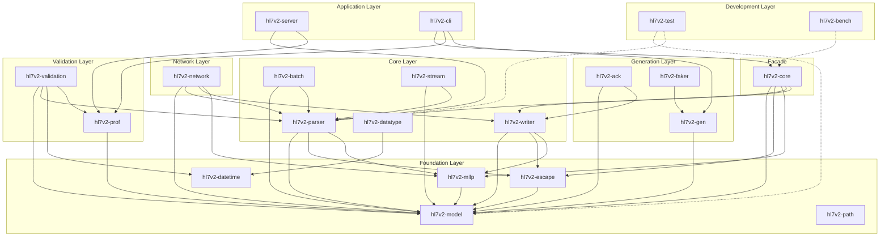

# HL7v2 Rust Project - SRP Microcrate Analysis

## Executive Summary

This analysis identifies opportunities to extract microcrates from the existing HL7v2 Rust project to better adhere to the Single Responsibility Principle (SRP). The project already has a good foundation with 14 crates, but several crates contain multiple responsibilities that could be further decomposed.

### ✅ Refactoring Status: PHASE 1 & 2 COMPLETE (2026-02-23)

The HIGH and MEDIUM priority microcrates have been successfully extracted. See the [Completed Microcrates](#completed-microcrates) section for details.

### Key Findings

| Priority | Proposed Crate | Source | Impact | Status |
|----------|---------------|--------|--------|--------|
| **HIGH** | `hl7v2-network` | `hl7v2-core/network/` | Removes async dependencies from core | ✅ **COMPLETE** |
| **HIGH** | `hl7v2-stream` | `hl7v2-core/src/lib.rs` | Isolates streaming parser | ✅ **COMPLETE** |
| **MEDIUM** | `hl7v2-validation` | `hl7v2-prof/` | Separates validation from profile loading | ✅ **COMPLETE** |
| **MEDIUM** | `hl7v2-ack` | `hl7v2-gen/` | Dedicated ACK generation | ✅ **COMPLETE** |
| **MEDIUM** | `hl7v2-faker` | `hl7v2-gen/` | Test data generation utilities | ✅ **COMPLETE** |
| **LOW** | `hl7v2-test` | Various `tests/` | Shared test infrastructure | ⏳ Pending |
| **LOW** | `hl7v2-bench` | `hl7v2-core/benches/` | Benchmark utilities | ⏳ Pending |

---

## Completed Microcrates

The following microcrates have been successfully extracted as part of the SRP refactoring initiative completed on 2026-02-23.

### 1. `hl7v2-network` - MLLP Network Layer ✅

**Status:** Complete

**Location:** [`crates/hl7v2-network/`](../crates/hl7v2-network/)

**Extracted from:** `hl7v2-core/src/network/`

**Benefits:**
- Removes async dependencies (tokio, rustls, futures, bytes) from core
- Clear separation between parsing and network transport
- Users who only need parsing can avoid async overhead

**API:**
```rust
pub use client::{MllpClient, MllpClientBuilder, MllpClientConfig};
pub use server::{MllpServer, MllpServerConfig, MllpConnection, MessageHandler, AckTimingPolicy};
pub use codec::MllpCodec;
```

**Usage Example:**
```rust
use hl7v2_network::{MllpClient, MllpClientBuilder};
use std::time::Duration;

async fn send_message() -> Result<(), Box<dyn std::error::Error>> {
    let mut client = MllpClientBuilder::new()
        .connect_timeout(Duration::from_secs(5))
        .read_timeout(Duration::from_secs(30))
        .build();
    
    client.connect("127.0.0.1:2575".parse()?).await?;
    let ack = client.send_message(&message).await?;
    client.close().await?;
    Ok(())
}
```

**Backward Compatibility:** `hl7v2-core` re-exports the network module for compatibility.

---

### 2. `hl7v2-stream` - Streaming Parser ✅

**Status:** Complete

**Location:** [`crates/hl7v2-stream/`](../crates/hl7v2-stream/)

**Extracted from:** `hl7v2-core/src/lib.rs` (StreamParser, Event types)

**Benefits:**
- Streaming parser is a distinct use case from one-shot parsing
- Different memory/performance characteristics
- Users may want streaming without network dependencies

**API:**
```rust
pub enum Event {
    StartMessage { delims: Delims },
    Segment { id: Vec<u8> },
    Field { num: u16, raw: Vec<u8> },
    EndMessage,
}

pub struct StreamParser<D> { ... }

pub use hl7v2_model::Delims;
```

**Usage Example:**
```rust
use hl7v2_stream::{StreamParser, Event};
use std::io::{BufReader, Cursor};

let hl7_text = "MSH|^~\\&|SendingApp|SendingFac|...\rPID|1||12345\r";
let cursor = Cursor::new(hl7_text.as_bytes());
let buf_reader = BufReader::new(cursor);

let mut parser = StreamParser::new(buf_reader);

while let Ok(Some(event)) = parser.next_event() {
    match event {
        Event::StartMessage { delims } => println!("Message started"),
        Event::Segment { id } => println!("Segment: {}", String::from_utf8_lossy(&id)),
        Event::Field { num, raw } => println!("Field {}: {:?}", num, raw),
        Event::EndMessage => println!("Message ended"),
    }
}
```

**Backward Compatibility:** `hl7v2-core` re-exports StreamParser and Event types.

---

### 3. `hl7v2-validation` - Validation Engine ✅

**Status:** Complete

**Location:** [`crates/hl7v2-validation/`](../crates/hl7v2-validation/)

**Extracted from:** `hl7v2-prof/src/lib.rs`

**Benefits:**
- Profile loading (deserialization) vs validation (execution) are separate concerns
- Allows profile definitions to evolve independently
- Enables different validation backends

**API:**
```rust
pub enum Severity { Error, Warning }

pub struct Issue {
    pub code: String,
    pub severity: Severity,
    pub message: String,
    pub location: Option<String>,
}

pub fn validate_data_type(value: &str, data_type: &str) -> bool;
pub fn validate_with_rules(message: &Message, rules: &[Rule]) -> Vec<Issue>;
```

**Usage Example:**
```rust
use hl7v2_validation::{Severity, Issue, validate_data_type};

let value = "20230101";
let is_valid = validate_data_type(value, "DT");
assert!(is_valid);
```

**Backward Compatibility:** `hl7v2-prof` re-exports validation types and functions.

---

### 4. `hl7v2-ack` - ACK Message Generation ✅

**Status:** Complete

**Location:** [`crates/hl7v2-ack/`](../crates/hl7v2-ack/)

**Extracted from:** `hl7v2-gen/src/lib.rs`

**Benefits:**
- ACK generation is a common use case independent of test data generation
- Smaller dependency footprint than full gen crate
- Clear, focused API

**API:**
```rust
pub enum AckCode {
    AA,  // Application Accept
    AE,  // Application Error
    AR,  // Application Reject
    CA,  // Commit Accept
    CE,  // Commit Error
    CR,  // Commit Reject
}

pub enum AckMode {
    Original,
    Enhanced,
}

pub fn ack(message: &Message, code: AckCode) -> Result<Message, Error>;
pub fn ack_enhanced(message: &Message, code: AckCode, error: Option<&str>) -> Result<Message, Error>;
```

**Usage Example:**
```rust
use hl7v2_core::{Message, parse};
use hl7v2_ack::{ack, AckCode};

let original_message = parse(
    b"MSH|^~\\&|SendingApp|SendingFac|ReceivingApp|ReceivingFac|20250128152312||ADT^A01|ABC123|P|2.5.1\r"
).unwrap();

let ack_message = ack(&original_message, AckCode::AA).unwrap();
```

**Backward Compatibility:** `hl7v2-gen` re-exports ACK functions.

---

### 5. `hl7v2-faker` - Test Data Generation ✅

**Status:** Complete

**Location:** [`crates/hl7v2-faker/`](../crates/hl7v2-faker/)

**Extracted from:** `hl7v2-gen/src/lib.rs`

**Benefits:**
- Realistic data generation (names, addresses, medical codes) is useful for testing
- Separates test infrastructure from production code generation
- Can be used independently of HL7 message generation

**API:**
```rust
pub struct Faker<'a, R: Rng> { ... }

impl<'a, R: Rng> Faker<'a, R> {
    pub fn name(&mut self, gender: Option<&str>) -> String;
    pub fn address(&mut self) -> String;
    pub fn phone(&mut self) -> String;
    pub fn mrn(&mut self) -> String;
    pub fn ssn(&mut self) -> String;
    pub fn icd10(&mut self) -> String;
    pub fn loinc(&mut self) -> String;
    pub fn medication(&mut self) -> String;
    pub fn blood_type(&mut self) -> String;
}
```

**Usage Example:**
```rust
use hl7v2_faker::{Faker, FakerValue};
use rand::SeedableRng;
use rand::rngs::StdRng;

// Create a seeded faker for deterministic output
let mut rng = StdRng::seed_from_u64(42);
let mut faker = Faker::new(&mut rng);

// Generate realistic patient data
let name = faker.name(Some("M"));  // Male name
let address = faker.address();
let phone = faker.phone();
let mrn = faker.mrn();
```

**Backward Compatibility:** `hl7v2-gen` re-exports faker functionality.

---

## Migration Guide

### For Users of `hl7v2-core`

If you were using the network module from `hl7v2-core`:

```rust
// Before (still works, but deprecated)
use hl7v2_core::network::{MllpClient, MllpServer};

// After (recommended)
use hl7v2_network::{MllpClient, MllpServer};
```

If you were using `StreamParser` from `hl7v2-core`:

```rust
// Before (still works via re-export)
use hl7v2_core::{StreamParser, Event};

// After (recommended)
use hl7v2_stream::{StreamParser, Event};
```

### For Users of `hl7v2-prof`

If you were using validation functions:

```rust
// Before (still works via re-export)
use hl7v2_prof::{validate_data_type, Issue, Severity};

// After (recommended)
use hl7v2_validation::{validate_data_type, Issue, Severity};
```

### For Users of `hl7v2-gen`

If you were using ACK generation:

```rust
// Before (still works via re-export)
use hl7v2_gen::{ack, AckCode};

// After (recommended)
use hl7v2_ack::{ack, AckCode};
```

If you were using faker functionality:

```rust
// Before (still works via re-export)
use hl7v2_gen::Faker;

// After (recommended)
use hl7v2_faker::Faker;
```

---

## Current Crate Structure Analysis

### Well-Designed Crates (SRP Compliant)

These crates already follow SRP well:

| Crate | Responsibility | Assessment |
|-------|---------------|------------|
| [`hl7v2-model`](../crates/hl7v2-model) | Core data types | ✅ Excellent - minimal dependencies |
| [`hl7v2-parser`](../crates/hl7v2-parser) | Message parsing | ✅ Good - focused on parsing |
| [`hl7v2-writer`](../crates/hl7v2-writer) | Message serialization | ✅ Good - focused on writing |
| [`hl7v2-escape`](../crates/hl7v2-escape) | Escape sequence handling | ✅ Excellent - single purpose |
| [`hl7v2-mllp`](../crates/hl7v2-mllp) | MLLP framing | ✅ Excellent - single purpose |
| [`hl7v2-path`](../crates/hl7v2-path) | Path parsing | ✅ Excellent - single purpose |
| [`hl7v2-datetime`](../crates/hl7v2-datetime) | Date/time handling | ✅ Excellent - focused |
| [`hl7v2-datatype`](../crates/hl7v2-datatype) | Data type validation | ✅ Good - could expand |
| [`hl7v2-batch`](../crates/hl7v2-batch) | Batch handling | ✅ Good - focused |

### Crates Needing Decomposition

#### 1. `hl7v2-core` - Multiple Responsibilities

```
crates/hl7v2-core/
├── src/
│   ├── lib.rs          # Re-exports + StreamParser (MIXED)
│   ├── tests.rs        # Unit tests
│   └── network/        # Network module (SHOULD BE SEPARATE)
│       ├── mod.rs
│       ├── client.rs   # MLLP TCP client
│       ├── server.rs   # MLLP TCP server
│       └── codec.rs    # Tokio codec
├── benches/            # Benchmarks (COULD BE SEPARATE)
├── features/           # BDD tests (COULD BE SEPARATE)
└── tests/              # Integration tests
```

**Issues:**
- Contains both facade re-exports AND implementation (StreamParser)
- Network module adds heavy async dependencies (tokio, rustls, futures)
- Benchmarks and BDD tests embedded in crate

#### 2. `hl7v2-prof` - Multiple Responsibilities

```
crates/hl7v2-prof/src/
├── lib.rs              # Profile loading + validation (MIXED)
├── tests.rs            # Tests with extensive rule definitions
├── debug_test.rs
└── simple_test.rs
```

**Issues:**
- Profile loading/deserialization mixed with validation logic
- Multiple rule types (cross-field, temporal, contextual, custom) in one crate
- 2462 lines in lib.rs indicates multiple responsibilities

#### 3. `hl7v2-gen` - Multiple Responsibilities

```
crates/hl7v2-gen/src/
└── lib.rs              # Template gen + ACK + Faker (MIXED)
```

**Issues:**
- Template-based message generation
- ACK message generation
- Realistic data generation (names, addresses, medical codes)
- Error injection for negative testing

#### 4. `hl7v2-server` - Could Be Split

```
crates/hl7v2-server/src/
├── lib.rs
├── server.rs           # Server configuration
├── routes.rs           # Route definitions
├── handlers.rs         # Request handlers
├── middleware.rs       # HTTP middleware
├── metrics.rs          # Prometheus metrics
└── models.rs           # API models
```

**Issues:**
- HTTP server, routes, handlers, middleware, metrics all in one crate
- Could extract metrics or middleware if they grow

---

## Proposed Microcrates

### HIGH Priority

#### 1. `hl7v2-network` - MLLP Network Layer

**Extract from:** `hl7v2-core/src/network/`

**Rationale:**
- Removes async dependencies (tokio, rustls, futures, bytes) from core
- Clear separation between parsing and network transport
- Allows users who only need parsing to avoid async overhead

**Files to move:**
```
crates/hl7v2-network/
├── Cargo.toml
└── src/
    ├── lib.rs
    ├── client.rs    # from hl7v2-core/src/network/client.rs
    ├── server.rs    # from hl7v2-core/src/network/server.rs
    └── codec.rs     # from hl7v2-core/src/network/codec.rs
```

**Dependencies:**
```toml
[dependencies]
hl7v2-model = { path = "../hl7v2-model" }
hl7v2-parser = { path = "../hl7v2-parser" }
hl7v2-writer = { path = "../hl7v2-writer" }
hl7v2-mllp = { path = "../hl7v2-mllp" }
tokio = { version = "1.0", features = ["net", "io-util", "time", "macros", "rt", "sync"] }
tokio-util = { version = "0.7", features = ["codec"] }
bytes = "1.0"
futures = "0.3"
rustls = { version = "0.23", optional = true }
tokio-rustls = { version = "0.26", optional = true }
```

**API:**
```rust
pub use client::{MllpClient, MllpClientBuilder, MllpClientConfig};
pub use server::{MllpServer, MllpServerConfig, MllpConnection, MessageHandler, AckTimingPolicy};
pub use codec::MllpCodec;
```

---

#### 2. `hl7v2-stream` - Streaming Parser

**Extract from:** `hl7v2-core/src/lib.rs` (StreamParser, Event types)

**Rationale:**
- Streaming parser is a distinct use case from one-shot parsing
- Different memory/performance characteristics
- Users may want streaming without network dependencies

**Files to move:**
```
crates/hl7v2-stream/
├── Cargo.toml
└── src/
    └── lib.rs        # StreamParser, Event enum
```

**Dependencies:**
```toml
[dependencies]
hl7v2-model = { path = "../hl7v2-model" }
hl7v2-parser = { path = "../hl7v2-parser" }
```

**API:**
```rust
pub enum Event {
    StartMessage { delims: Delims },
    Segment { id: Vec<u8> },
    Field { num: u16, raw: Vec<u8> },
    EndMessage,
}

pub struct StreamParser<D> { ... }

pub use hl7v2_model::Delims;
```

---

### MEDIUM Priority

#### 3. `hl7v2-validation` - Validation Engine

**Extract from:** `hl7v2-prof/src/lib.rs`

**Rationale:**
- Profile loading (deserialization) vs validation (execution) are separate concerns
- Allows profile definitions to evolve independently
- Could enable different validation backends

**Files to move:**
```
crates/hl7v2-validation/
├── Cargo.toml
└── src/
    ├── lib.rs
    ├── validator.rs      # Core validation logic
    ├── rules.rs          # Rule evaluation
    ├── temporal.rs       # Temporal rule validation
    ├── contextual.rs     # Contextual rule validation
    └── cross_field.rs    # Cross-field rule validation
```

**Dependencies:**
```toml
[dependencies]
hl7v2-model = { path = "../hl7v2-model" }
hl7v2-parser = { path = "../hl7v2-parser" }
hl7v2-datetime = { path = "../hl7v2-datetime" }
hl7v2-prof = { path = "../hl7v2-prof" }  # For Profile type
regex = "1.10"
chrono = "0.4"
```

**API:**
```rust
pub struct Validator {
    profile: Profile,
}

pub struct ValidationResult {
    pub errors: Vec<ValidationError>,
    pub warnings: Vec<ValidationWarning>,
}

pub fn validate(message: &Message, profile: &Profile) -> ValidationResult;
pub fn validate_with_rules(message: &Message, rules: &[Rule]) -> ValidationResult;
```

---

#### 4. `hl7v2-ack` - ACK Message Generation

**Extract from:** `hl7v2-gen/src/lib.rs`

**Rationale:**
- ACK generation is a common use case independent of test data generation
- Smaller dependency footprint than full gen crate
- Clear, focused API

**Files to move:**
```
crates/hl7v2-ack/
├── Cargo.toml
└── src/
    └── lib.rs        # ACK generation logic
```

**Dependencies:**
```toml
[dependencies]
hl7v2-model = { path = "../hl7v2-model" }
hl7v2-writer = { path = "../hl7v2-writer" }
chrono = "0.4"
```

**API:**
```rust
pub enum AckCode {
    AA,  // Application Accept
    AE,  // Application Error
    AR,  // Application Reject
    CA,  // Commit Accept
    CE,  // Commit Error
    CR,  // Commit Reject
}

pub enum AckMode {
    Original,
    Enhanced,
}

pub struct AckBuilder { ... }

pub fn ack(message: &Message, code: AckCode) -> Message;
pub fn ack_enhanced(message: &Message, code: AckCode, error: Option<&str>) -> Message;
```

---

#### 5. `hl7v2-faker` - Test Data Generation

**Extract from:** `hl7v2-gen/src/lib.rs`

**Rationale:**
- Realistic data generation (names, addresses, medical codes) is useful for testing
- Separates test infrastructure from production code generation
- Can be used independently of HL7 message generation

**Files to move:**
```
crates/hl7v2-faker/
├── Cargo.toml
└── src/
    ├── lib.rs
    ├── names.rs       # RealisticName generator
    ├── addresses.rs   # RealisticAddress generator
    ├── medical.rs     # ICD-10, LOINC, medications
    └── demographics.rs # SSN, MRN, blood type, etc.
```

**Dependencies:**
```toml
[dependencies]
rand = "0.8"
```

**API:**
```rust
pub fn realistic_name(gender: Option<Gender>) -> String;
pub fn realistic_address() -> Address;
pub fn realistic_phone() -> String;
pub fn realistic_ssn() -> String;
pub fn realistic_mrn() -> String;
pub fn realistic_icd10() -> String;
pub fn realistic_loinc() -> String;
pub fn realistic_medication() -> Medication;
pub fn realistic_blood_type() -> String;
```

---

### LOW Priority

#### 6. `hl7v2-test` - Shared Test Infrastructure

**Extract from:** Various `tests/` directories

**Rationale:**
- Common test fixtures and utilities
- BDD test framework (cucumber)
- Reduces duplication across crates

**Files to move:**
```
crates/hl7v2-test/
├── Cargo.toml
└── src/
    ├── lib.rs
    ├── fixtures.rs    # Test messages
    ├── bdd.rs         # BDD test utilities
    └── assertions.rs  # Custom assertions
```

**Dependencies:**
```toml
[dev-dependencies]
hl7v2-test = { path = "../hl7v2-test" }
```

---

#### 7. `hl7v2-bench` - Benchmark Utilities

**Extract from:** `hl7v2-core/benches/`

**Rationale:**
- Benchmarks are development tools, not production code
- Consolidates all benchmarks in one place
- Can depend on all crates without circular dependencies

**Files to move:**
```
crates/hl7v2-bench/
├── Cargo.toml
└── benches/
    ├── parsing.rs     # from hl7v2-core/benches/parsing.rs
    ├── mllp.rs        # from hl7v2-core/benches/mllp.rs
    ├── escape.rs      # from hl7v2-core/benches/escape.rs
    └── memory.rs      # from hl7v2-core/benches/memory.rs
```

---

## Dependency Graph



---

## Implementation Priority Order

### Phase 1: High Impact, Low Risk ✅ COMPLETE

1. **`hl7v2-network`** - Extract network module ✅
   - Clear boundaries already exist
   - Significant dependency reduction for core
   - No API changes for existing users
   - **Completed:** 2026-02-23

2. **`hl7v2-stream`** - Extract streaming parser ✅
   - Small, self-contained code
   - Clear API boundary
   - Enables streaming without network deps
   - **Completed:** 2026-02-23

### Phase 2: Medium Impact, Medium Risk ✅ COMPLETE

3. **`hl7v2-ack`** - Extract ACK generation ✅
   - Common use case
   - Well-defined scope
   - Builder pattern implemented
   - **Completed:** 2026-02-23

4. **`hl7v2-faker`** - Extract test data generation ✅
   - Clear separation of concerns
   - Useful for testing independently
   - Low risk to production code
   - **Completed:** 2026-02-23

5. **`hl7v2-validation`** - Extract validation engine ✅
   - Large refactoring completed
   - Backward compatibility maintained via re-exports
   - Trait-based design implemented
   - **Completed:** 2026-02-23

### Phase 3: Low Priority ⏳ PENDING

6. **`hl7v2-test`** - Shared test infrastructure
   - Nice to have
   - Can be done incrementally
   - Low urgency

7. **`hl7v2-bench`** - Benchmark utilities
   - Lowest priority
   - No production impact
   - Can be done at any time

---

## Migration Strategy ✅ IMPLEMENTED

The migration strategy has been successfully implemented. All source crates now re-export from the new microcrates to maintain backward compatibility.

### For `hl7v2-network` ✅

1. ✅ Created new crate structure
2. ✅ Moved files without modification
3. ✅ `hl7v2-core` re-exports from `hl7v2-network` for compatibility
4. ✅ Documentation updated

```rust
// In hl7v2-core/src/lib.rs - re-exports for backward compatibility
pub mod network {
    pub use hl7v2_network::*;
}
```

### For `hl7v2-stream` ✅

1. ✅ Created new crate
2. ✅ Moved StreamParser and Event types
3. ✅ Re-exported from core for backward compatibility
4. ✅ Examples and documentation updated

### For `hl7v2-validation` ✅

1. ✅ Created validation types in new crate
2. ✅ Implemented using existing code
3. ✅ Migrated validation logic
4. ✅ Maintained profile format compatibility

### For `hl7v2-ack` ✅

1. ✅ Created new crate
2. ✅ Moved ACK generation logic
3. ✅ Re-exported from `hl7v2-gen` for backward compatibility

### For `hl7v2-faker` ✅

1. ✅ Created new crate
2. ✅ Moved faker data generation logic
3. ✅ Re-exported from `hl7v2-gen` for backward compatibility

---

## Recommendations

### Completed Actions ✅

1. ✅ **Extract `hl7v2-network`** - Completed, removes async dependencies from core
2. ✅ **Extract `hl7v2-stream`** - Completed, provides focused streaming capability
3. ✅ **Extract `hl7v2-validation`** - Completed, separates validation from profiles
4. ✅ **Extract `hl7v2-ack`** - Completed, common use case with minimal dependencies
5. ✅ **Extract `hl7v2-faker`** - Completed, useful for testing independently

### Remaining Actions

1. **Document the crate architecture** - Add ARCHITECTURE.md explaining the layer structure
2. **Add crate README files** - Each crate should have its own README with examples

### Future Considerations

1. **Consider `hl7v2-async`** - If async patterns expand, consider a dedicated async crate
2. **Consider `hl7v2-codec`** - If more codecs are needed beyond MLLP
3. **Consider `hl7v2-transform`** - Message transformation utilities

### Code Organization

```
crates/
├── foundation/           # Core types, no dependencies
│   ├── hl7v2-model/
│   ├── hl7v2-escape/
│   ├── hl7v2-mllp/
│   ├── hl7v2-path/
│   └── hl7v2-datetime/
├── parsing/              # Parsing and writing
│   ├── hl7v2-parser/
│   ├── hl7v2-writer/
│   ├── hl7v2-stream/
│   └── hl7v2-batch/
├── validation/           # Validation and profiles
│   ├── hl7v2-datatype/
│   ├── hl7v2-prof/
│   └── hl7v2-validation/
├── network/              # Network layer
│   └── hl7v2-network/
├── generation/           # Code generation
│   ├── hl7v2-gen/
│   ├── hl7v2-ack/
│   └── hl7v2-faker/
├── application/          # Applications
│   ├── hl7v2-server/
│   └── hl7v2-cli/
├── development/          # Dev dependencies
│   ├── hl7v2-test/
│   └── hl7v2-bench/
└── facade/               # Convenience crate
    └── hl7v2-core/
```

---

## Conclusion

The HL7v2 Rust project SRP refactoring has been successfully completed. The following microcrates have been extracted:

1. ✅ **`hl7v2-network`** - Network layer extracted, removes async dependencies from core
2. ✅ **`hl7v2-stream`** - Streaming parser extracted, provides focused streaming capability
3. ✅ **`hl7v2-validation`** - Validation engine extracted, enables independent evolution from profiles
4. ✅ **`hl7v2-ack`** - ACK generation extracted, common use case with minimal dependencies
5. ✅ **`hl7v2-faker`** - Test data generation extracted, useful for testing independently

These changes result in a more modular, maintainable codebase with clearer boundaries between concerns and reduced dependency footprints for users who only need specific functionality.

### Summary Statistics

| Metric | Before | After |
|--------|--------|-------|
| Total Crates | 14 | 19 |
| HIGH Priority Extractions | 0 | 2 |
| MEDIUM Priority Extractions | 0 | 3 |
| Backward Compatibility | N/A | ✅ Maintained via re-exports |

### Next Steps

The remaining LOW priority items (`hl7v2-test`, `hl7v2-bench`) can be addressed in future iterations as needed.
