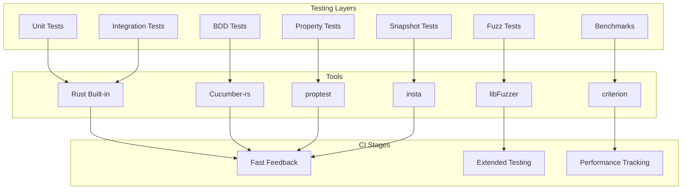

# HL7 v2 Rust Workspace - Testing Architecture

**Version:** 1.0  
**Created:** 2026-02-24  
**Status:** Design Document

## Table of Contents

1. [Executive Summary](#executive-summary)
2. [Testing Stack](#testing-stack)
3. [Shared Test Utilities Crate](#shared-test-utilities-crate)
4. [Test Organization Standards](#test-organization-standards)
5. [Naming Conventions](#naming-conventions)
6. [Priority Matrix](#priority-matrix)
7. [CI Integration Strategy](#ci-integration-strategy)
8. [Sample Test Implementations](#sample-test-implementations)
9. [Incremental Adoption Plan](#incremental-adoption-plan)

---

## Executive Summary

This document defines the comprehensive testing architecture for the hl7v2-rs workspace, covering all 26 microcrates. The architecture is designed to be:

- **Incrementally Adoptable**: Crates can adopt testing patterns progressively
- **Consistent**: Standardized patterns across all crates
- **Practical**: Focused on high-value tests for healthcare data processing
- **Maintainable**: Shared utilities reduce duplication

### Key Architectural Decisions

| Decision | Rationale |
|----------|-----------|
| Create `hl7v2-test-utils` crate | Centralize test fixtures, reduce duplication across 26 crates |
| Use Cucumber-rs for BDD | Already configured, supports healthcare workflow documentation |
| Use proptest for property-based testing | Already in workspace, catches edge cases in parsers |
| Use cargo-fuzz with libFuzzer | Already configured, critical for malformed input handling |
| Use insta for snapshot testing | New addition, essential for JSON/HL7 output verification |
| Use criterion for benchmarks | Already in hl7v2-bench, track performance regressions |

---

## Testing Stack

### Framework Components



### Tool Justification

| Tool | Version | Purpose | Justification |
|------|---------|---------|---------------|
| **Rust Built-in** | Stable | Unit/Integration | Zero dependencies, fast execution, `#[test]` attribute |
| **Cucumber-rs** | 0.22+ | BDD | Already configured, human-readable scenarios for healthcare workflows |
| **proptest** | 1.6+ | Property-based | Already in workspace, generates edge cases automatically |
| **libFuzzer** | Latest | Fuzzing | Already configured via cargo-fuzz, finds crashes in parsers |
| **insta** | 1.x | Snapshots | New addition, golden master testing for HL7/JSON output |
| **criterion** | 0.5+ | Benchmarks | Already in hl7v2-bench, statistical analysis of performance |

### Tool Configuration

#### Workspace Cargo.toml Additions

```toml
[workspace.dependencies]
# Testing frameworks
cucumber = { version = "0.22", default-features = false, features = ["macros"] }
proptest = "1.6"
insta = { version = "1.42", features = ["yaml", "json"] }
criterion = { version = "0.5", features = ["html_reports"] }
tokio-test = "0.4"
assert_matches = "1.5"
pretty_assertions = "1.4"

# Fuzzing - uses cargo-fuzz CLI tool
# libfuzzer-sys is managed by cargo-fuzz

# Coverage
llvm-cov = "0.6"  # Used via cargo-llvm-cov CLI
```

---

## Shared Test Utilities Crate

### Crate Structure: `crates/hl7v2-test-utils`

```
crates/hl7v2-test-utils/
├── Cargo.toml
├── README.md
└── src/
    ├── lib.rs                    # Public exports
    ├── fixtures/
    │   ├── mod.rs
    │   ├── messages.rs           # HL7 message fixtures
    │   ├── segments.rs           # Individual segment fixtures
    │   ├── profiles.rs           # Conformance profile fixtures
    │   └── templates.rs          # Template fixtures
    ├── builders/
    │   ├── mod.rs
    │   ├── message_builder.rs    # Fluent message builder
    │   └── segment_builder.rs    # Fluent segment builder
    ├── assertions/
    │   ├── mod.rs
    │   ├── hl7_assertions.rs     # HL7-specific assertions
    │   └── json_assertions.rs    # JSON output assertions
    ├── generators/
    │   ├── mod.rs
    │   ├── random_message.rs     # Random message generation
    │   └── edge_cases.rs         # Edge case generators
    ├── mocks/
    │   ├── mod.rs
    │   ├── network.rs            # Network mocks for MLLP
    │   └── time.rs               # Time freezing utilities
    └── helpers/
        ├── mod.rs
        ├── parse.rs              # Parse helpers
        └── file.rs               # Test file utilities
```

### Cargo.toml for hl7v2-test-utils

```toml
[package]
name = "hl7v2-test-utils"
version.workspace = true
edition.workspace = true
description = "Shared test utilities for hl7v2-rs workspace"
license.workspace = true
publish = false  # Dev-only crate

[dependencies]
hl7v2-model = { path = "../hl7v2-model" }
hl7v2-parser = { path = "../hl7v2-parser" }
hl7v2-writer = { path = "../hl7v2-writer" }
hl7v2-core = { path = "../hl7v2-core" }
thiserror.workspace = true
serde.workspace = true
serde_json.workspace = true

[dev-dependencies]
pretty_assertions.workspace = true
```

### Core Module: src/lib.rs

```rust
//! Shared test utilities for hl7v2-rs workspace
//!
//! This crate provides common test fixtures, builders, assertions,
//! and utilities used across all 26 microcrates.

pub mod fixtures;
pub mod builders;
pub mod assertions;
pub mod generators;
pub mod mocks;
pub mod helpers;

// Re-exports for convenience
pub use fixtures::{
    messages::SampleMessage,
    segments::SampleSegment,
    profiles::SampleProfile,
};

pub use builders::{
    MessageBuilder,
    SegmentBuilder,
};

pub use assertions::{
    assert_message_valid,
    assert_json_matches_snapshot,
    assert_hl7_roundtrips,
};
```

### Fixtures Module: src/fixtures/messages.rs

```rust
//! Sample HL7 messages for testing

use once_cell::sync::Lazy;

/// Sample ADT^A01 message - Admit/Visit Notification
pub const ADT_A01: &str = concat!(
    "MSH|^~\\&|SendingApp|SendingFac|ReceivingApp|ReceivingFac|",
    "20250128152312||ADT^A01^ADT_A01|ABC123|P|2.5.1\r",
    "EVN|A01|20250128152312|||\r",
    "PID|1||123456^^^HOSP^MR||Doe^John^A||19800101|M|||C|\r",
    "PV1|1|I|ICU^101^01||||DOC123^Smith^Jane||||||||V123456\r"
);

/// Sample ADT^A04 message - Register Patient
pub const ADT_A04: &str = concat!(
    "MSH|^~\\&|RegSys|Hospital|ADT|Hospital|",
    "20250128140000||ADT^A04|MSG002|P|2.5\r",
    "PID|1||MRN456^^^Hospital^MR||Smith^Jane^M||19900215|F\r"
);

/// Sample ORU^R01 message - Lab Results
pub const ORU_R01: &str = concat!(
    "MSH|^~\\&|LabSys|Lab|LIS|Hospital|",
    "20250128150000||ORU^R01|MSG003|P|2.5\r",
    "PID|1||MRN789^^^Lab^MR||Patient^Test||19850610|M\r",
    "OBR|1|ORD123|FIL456|CBC^Complete Blood Count|||20250128120000\r",
    "OBX|1|NM|WBC^White Blood Count||7.5|10^9/L|4.0-11.0|N|||F\r"
);

/// Collection of all valid sample messages
pub static VALID_MESSAGES: Lazy<Vec<(&'static str, &'static str)>> = Lazy::new(|| {
    vec![
        ("ADT_A01", ADT_A01),
        ("ADT_A04", ADT_A04),
        ("ORU_R01", ORU_R01),
    ]
});

/// Messages with edge cases for testing
pub mod edge_cases {
    /// Message with escape sequences
    pub const WITH_ESCAPES: &str = concat!(
        "MSH|^~\\&|App|Fac|||20250128120000||ADT^A01|1|P|2.5\r",
        "PID|1||123||Test\\F\\Value\r"  // Contains escaped field separator
    );

    /// Message with custom delimiters
    pub const CUSTOM_DELIMS: &str = concat!(
        "MSH#$*@!App#Fac#Rec#RecFac#20250128120000##ADT$A01#1#P#2.5\r",
        "PID#1##123##Name$First\r"
    );

    /// Message with field repetitions
    pub const WITH_REPETITIONS: &str = concat!(
        "MSH|^~\\&|App|Fac|||20250128120000||ADT^A01|1|P|2.5\r",
        "PID|1||123||Doe^John~Smith^Jane\r"
    );

    /// Message with all optional components
    pub const FULLY_POPULATED: &str = concat!(
        "MSH|^~\\&|SendingApp|SendingFac|ReceivingApp|ReceivingFac|",
        "20250128152312+0000||ADT^A01^ADT_A01|ABC123|P|2.5.1|||AL|NE|ASCII\r",
        "EVN|A01|20250128152312+0000|20250128160000||DOC123^Smith^Jane^^^^MD^^^NPI^12345\r",
        "PID|1||123456^^^HOSP^MR||Doe^John^Adam^III^Sr.||19800101|M||C|",
        "123 Main St^Apt 4B^Anytown^ST^12345^USA||(555)555-1212|(555)555-1213||E|S|||123456789|\r"
    );
}

/// Invalid messages for error testing
pub mod invalid {
    /// Missing MSH segment
    pub const NO_MSH: &str = "PID|1||123||Doe^John\r";

    /// Invalid encoding characters
    pub const BAD_ENCODING: &str = "MSH|SendingApp\r";

    /// Truncated message
    pub const TRUNCATED: &str = "MSH|^~\\&|App|Fac";

    /// Invalid segment terminator
    pub const BAD_TERMINATOR: &str = "MSH|^~\\&|App|Fac\nPID|1||123";
}
```

### Builders Module: src/builders/message_builder.rs

```rust
//! Fluent message builder for tests

use hl7v2_model::{Message, Segment, Delims};

/// Builder for creating test messages
pub struct MessageBuilder {
    segments: Vec<Segment>,
    delims: Delims,
}

impl MessageBuilder {
    /// Create a new message builder with default MSH
    pub fn new() -> Self {
        Self {
            segments: vec![],
            delims: Delims::default(),
        }
    }

    /// Create builder with pre-populated MSH segment
    pub fn adt_a01() -> Self {
        let mut builder = Self::new();
        builder.msh("SendingApp", "SendingFac", "ReceivingApp", "ReceivingFac", "ADT", "A01");
        builder
    }

    /// Add MSH segment
    pub fn msh(mut self, sending_app: &str, sending_fac: &str, 
               receiving_app: &str, receiving_fac: &str,
               msg_type: &str, trigger: &str) -> Self {
        // Build MSH segment...
        self
    }

    /// Add PID segment
    pub fn pid(mut self, mrn: &str, last_name: &str, first_name: &str) -> Self {
        // Build PID segment...
        self
    }

    /// Add PV1 segment
    pub fn pv1(mut self, patient_class: &str, location: &str) -> Self {
        // Build PV1 segment...
        self
    }

    /// Add custom segment
    pub fn segment(mut self, segment: Segment) -> Self {
        self.segments.push(segment);
        self
    }

    /// Use custom delimiters
    pub fn with_delims(mut self, delims: Delims) -> Self {
        self.delims = delims;
        self
    }

    /// Build the message
    pub fn build(self) -> Message {
        Message::new(self.segments, self.delims)
    }

    /// Build and parse as bytes
    pub fn build_bytes(self) -> Vec<u8> {
        let message = self.build();
        hl7v2_writer::write(&message).into_bytes()
    }
}

impl Default for MessageBuilder {
    fn default() -> Self {
        Self::new()
    }
}
```

### Assertions Module: src/assertions/hl7_assertions.rs

```rust
//! HL7-specific test assertions

use hl7v2_model::Message;
use hl7v2_parser::parse;
use hl7v2_writer::write;

/// Assert that a message is valid and parseable
pub fn assert_message_valid(bytes: &[u8]) -> Message {
    parse(bytes).expect("Message should be valid")
}

/// Assert that a message round-trips through parse/write
pub fn assert_hl7_roundtrips(bytes: &[u8]) {
    let message = parse(bytes).expect("Parse should succeed");
    let rewritten = write(&message);
    let reparsed = parse(rewritten.as_bytes()).expect("Reparse should succeed");
    
    assert_eq!(
        message.segments().len(),
        reparsed.segments().len(),
        "Segment count should match after round-trip"
    );
}

/// Assert that parsing fails with expected error
pub fn assert_parse_fails(bytes: &[u8], expected_error_contains: &str) {
    match parse(bytes) {
        Ok(_) => panic!("Expected parse to fail, but it succeeded"),
        Err(e) => {
            assert!(
                e.to_string().contains(expected_error_contains),
                "Expected error containing '{}', got: {}",
                expected_error_contains,
                e
            );
        }
    }
}

/// Assert field value at path
pub fn assert_field_value(message: &Message, path: &str, expected: &str) {
    let actual = hl7v2_query::get(message, path)
        .expect("Path should exist")
        .expect("Field should have value");
    
    assert_eq!(actual, expected, "Field value at {} mismatch", path);
}
```

---

## Test Organization Standards

### Standard Directory Structure

Each microcrate should follow this structure:

```
crates/hl7v2-<name>/
├── Cargo.toml
├── src/
│   ├── lib.rs
│   ├── <module>.rs
│   └── tests/                    # Unit tests (optional module structure)
│       ├── mod.rs                # If using tests/ directory
│       ├── <module>_test.rs
│       └── integration_test.rs   # For integration-style unit tests
├── tests/                        # Integration tests (separate crate context)
│   ├── common/
│   │   └── mod.rs                # Shared test utilities
│   ├── <feature>_test.rs
│   └── bdd_tests.rs              # BDD test runner
├── features/                     # BDD feature files
│   └── <feature>.feature
├── benches/                      # Benchmarks
│   └── <benchmark>.rs
└── fuzz/                         # Fuzz targets
    ├── Cargo.toml
    └── fuzz_targets/
        └── <target>.rs
```

### Unit Tests: src/tests.rs vs src/tests/

| Approach | When to Use |
|----------|-------------|
| `src/tests.rs` | Simple crates with < 200 lines of tests |
| `src/tests/` | Complex crates with multiple test modules |
| Inline `#[cfg(test)]` | Tests closely coupled to specific functions |

**Recommendation**: Use `src/tests/` directory for most crates to allow organized growth.

### Integration Tests: tests/

Integration tests are compiled as separate crates and can only access the public API.

```rust
// tests/integration_test.rs
use hl7v2_parser::parse;
use hl7v2_test_utils::fixtures::messages::ADT_A01;

#[test]
fn test_parse_sample_message() {
    let result = parse(ADT_A01.as_bytes());
    assert!(result.is_ok());
}
```

### BDD Tests: features/ and tests/bdd_tests.rs

Feature files describe behavior in human-readable format:

```gherkin
# features/parsing.feature
Feature: HL7 v2 Message Parsing
  As an HL7 message processor
  I want to parse HL7 v2 messages
  So that I can extract and validate healthcare data

  Scenario: Parse a simple ADT^A01 message
    Given a valid HL7 ADT^A01 message
    When I parse the message
    Then the message should have 3 segments
    And the first segment should be MSH
```

Test runner implementation:

```rust
// tests/bdd_tests.rs
use cucumber::{given, then, when, World};
use hl7v2_parser::parse;
use hl7v2_test_utils::fixtures::messages::ADT_A01;

#[derive(Debug, World)]
#[world(init = Self::new)]
pub struct HL7World {
    message: Option<Result<Message, Error>>,
    raw_bytes: Vec<u8>,
}

impl HL7World {
    fn new() -> Self {
        Self { message: None, raw_bytes: Vec::new() }
    }
}

#[given("a valid HL7 ADT^A01 message")]
fn given_valid_adt_a01(world: &mut HL7World) {
    world.raw_bytes = ADT_A01.as_bytes().to_vec();
}

#[when("I parse the message")]
fn when_parse_message(world: &mut HL7World) {
    world.message = Some(parse(&world.raw_bytes));
}

#[then("the message should have 3 segments")]
fn then_has_three_segments(world: &mut HL7World) {
    let msg = world.message.as_ref().unwrap().as_ref().unwrap();
    assert_eq!(msg.segments().len(), 3);
}

#[tokio::main]
async fn main() {
    HL7World::run("tests/features").await;
}
```

### Fuzz Tests: fuzz/

Fuzz targets should be minimal and focused:

```rust
// fuzz/fuzz_targets/parser.rs
#![no_main]

use hl7v2_parser::parse;
use libfuzzer_sys::fuzz_target;

fuzz_target!(|data: &[u8]| {
    // Fuzz the parser - should never panic/crash
    let _ = parse(data);
});
```

### Benchmarks: benches/

```rust
// benches/parsing.rs
use criterion::{black_box, criterion_group, criterion_main, Criterion};
use hl7v2_parser::parse;
use hl7v2_test_utils::fixtures::messages::ADT_A01;

fn bench_parse_adt_a01(c: &mut Criterion) {
    let bytes = ADT_A01.as_bytes();
    c.bench_function("parse_adt_a01", |b| {
        b.iter(|| parse(black_box(bytes)))
    });
}

criterion_group!(benches, bench_parse_adt_a01);
criterion_main!(benches);
```

---

## Naming Conventions

### Test Function Names

| Pattern | Example | Purpose |
|---------|---------|---------|
| `test_<unit>_<scenario>` | `test_parse_valid_message` | Unit test for specific scenario |
| `test_<unit>_<scenario>_returns_<result>` | `test_parse_invalid_returns_error` | Tests with specific outcome |
| `test_<unit>_<scenario>_with_<condition>` | `test_parse_with_custom_delimiters` | Tests with specific conditions |
| `it_<behavior>` | `it_roundtrips_through_write` | BDD-style unit tests |
| `should_<expected_behavior>_when_<condition>` | `should_return_error_when_msh_missing` | Documentation-focused |

### Test Module Names

| Location | Naming |
|----------|--------|
| `src/tests.rs` | `mod tests { ... }` |
| `src/tests/` | `mod tests;` with files like `parsing_test.rs` |
| `tests/` | `<feature>_test.rs` or `<feature>_tests.rs` |
| `features/` | `<feature>.feature` |

### Snapshot Files

Insta snapshots are stored in `snapshots/` directory:

```
snapshots/
├── <crate_name>__<test_name>.snap
└── <crate_name>__<test_name>.snap.new  # Pending updates
```

Example: `hl7v2_json__to_json_simple_message.snap`

---

## Priority Matrix

### Test Type Priority by Crate Category

#### Parser/Processor Crates (High Priority)

| Crate | Unit | Integration | BDD | Property | Fuzz | Snapshot | Benchmark |
|-------|:----:|:-----------:|:---:|:--------:|:----:|:--------:|:---------:|
| hl7v2-parser | **R** | **R** | **R** | **R** | **R** | O | R |
| hl7v2-writer | **R** | **R** | O | **R** | O | **R** | R |
| hl7v2-escape | **R** | O | O | **R** | **R** | O | O |
| hl7v2-mllp | **R** | **R** | O | O | **R** | O | R |
| hl7v2-stream | **R** | **R** | O | **R** | O | O | **R** |
| hl7v2-normalize | **R** | **R** | O | O | O | **R** | O |

#### Model/Data Crates (Medium Priority)

| Crate | Unit | Integration | BDD | Property | Fuzz | Snapshot | Benchmark |
|-------|:----:|:-----------:|:---:|:--------:|:----:|:--------:|:---------:|
| hl7v2-model | **R** | O | O | **R** | O | O | O |
| hl7v2-query | **R** | O | O | **R** | O | O | O |
| hl7v2-path | **R** | O | O | **R** | O | O | O |
| hl7v2-batch | **R** | **R** | O | O | O | O | O |
| hl7v2-json | **R** | **R** | O | O | O | **R** | O |

#### Validation Crates (High Priority)

| Crate | Unit | Integration | BDD | Property | Fuzz | Snapshot | Benchmark |
|-------|:----:|:-----------:|:---:|:--------:|:----:|:--------:|:---------:|
| hl7v2-validation | **R** | **R** | **R** | **R** | O | **R** | O |
| hl7v2-datatype | **R** | O | **R** | **R** | O | O | O |
| hl7v2-datetime | **R** | O | O | **R** | O | O | O |
| hl7v2-prof | **R** | **R** | **R** | O | O | **R** | O |

#### Network/Server Crates (High Priority)

| Crate | Unit | Integration | BDD | Property | Fuzz | Snapshot | Benchmark |
|-------|:----:|:-----------:|:---:|:--------:|:----:|:--------:|:---------:|
| hl7v2-network | **R** | **R** | O | O | **R** | O | **R** |
| hl7v2-server | **R** | **R** | **R** | O | **R** | O | **R** |
| hl7v2-cli | **R** | **R** | **R** | O | O | **R** | O |

#### Generation/Template Crates (Medium Priority)

| Crate | Unit | Integration | BDD | Property | Fuzz | Snapshot | Benchmark |
|-------|:----:|:-----------:|:---:|:--------:|:----:|:--------:|:---------:|
| hl7v2-template | **R** | **R** | O | **R** | O | **R** | O |
| hl7v2-template-values | **R** | **R** | **R** | **R** | **R** | O | O |
| hl7v2-gen | **R** | **R** | O | **R** | O | **R** | O |
| hl7v2-faker | **R** | O | O | **R** | O | O | O |
| hl7v2-ack | **R** | **R** | O | O | O | **R** | O |
| hl7v2-corpus | **R** | **R** | O | **R** | O | **R** | O |

#### Core/Facade Crates (Low Priority)

| Crate | Unit | Integration | BDD | Property | Fuzz | Snapshot | Benchmark |
|-------|:----:|:-----------:|:---:|:--------:|:----:|:--------:|:---------:|
| hl7v2-core | **R** | **R** | **R** | O | O | O | O |
| hl7v2-bench | O | O | O | O | O | O | **R** |

**Legend:**
- **R** = Required (must have for production)
- **r** = Recommended (should have for quality)
- **O** = Optional (nice to have)
- Blank = Not applicable

### Coverage Goals by Crate Type

| Crate Type | Line Coverage | Branch Coverage | Documentation |
|------------|---------------|-----------------|---------------|
| Parser/Processor | 90%+ | 85%+ | All public APIs |
| Validation | 95%+ | 90%+ | All public APIs |
| Network/Server | 85%+ | 80%+ | All public APIs |
| Model/Data | 80%+ | 75%+ | All public APIs |
| Generation | 80%+ | 75%+ | All public APIs |
| Core/Facade | 70%+ | 65%+ | Re-exports documented |

---

## CI Integration Strategy

### Pipeline Stages

```mermaid
graph LR
    subgraph Stage 1 - Fast
        A[Format Check] --> B[Clippy]
        B --> C[Unit Tests]
        C --> D[Doc Tests]
    end
    
    subgraph Stage 2 - Standard
        E[Integration Tests] --> F[BDD Tests]
        F --> G[Property Tests - Limited]
    end
    
    subgraph Stage 3 - Extended
        H[Property Tests - Full] --> I[Coverage Report]
        I --> J[Benchmarks]
    end
    
    subgraph Stage 4 - Nightly
        K[Fuzz Tests] --> L[Mutation Tests]
    end
    
    D --> E
    G --> H
    J --> K
```



### GitHub Actions Workflow

```yaml
# .github/workflows/test.yml
name: Test Suite

on:
  push:
    branches: [main]
  pull_request:
    branches: [main]

jobs:
  fast-tests:
    name: Fast Tests
    runs-on: ubuntu-latest
    steps:
      - uses: actions/checkout@v4
      - uses: dtolnay/rust-toolchain@stable
      - uses: Swatinem/rust-cache@v2
      
      - name: Check formatting
        run: cargo fmt --all -- --check
      
      - name: Clippy
        run: cargo clippy --all-targets -- -D warnings
      
      - name: Unit tests
        run: cargo test --lib --all
      
      - name: Doc tests
        run: cargo test --doc --all

  integration-tests:
    name: Integration Tests
    runs-on: ubuntu-latest
    needs: fast-tests
    steps:
      - uses: actions/checkout@v4
      - uses: dtolnay/rust-toolchain@stable
      - uses: Swatinem/rust-cache@v2
      
      - name: Integration tests
        run: cargo test --test '*' --all
      
      - name: BDD tests
        run: |
          cargo test --test bdd_tests -p hl7v2-core
          cargo test --test bdd_tests -p hl7v2-template-values

  property-tests:
    name: Property Tests
    runs-on: ubuntu-latest
    needs: fast-tests
    steps:
      - uses: actions/checkout@v4
      - uses: dtolnay/rust-toolchain@stable
      - uses: Swatinem/rust-cache@v2
      
      - name: Property tests (limited cases)
        run: PROPTEST_CASES=100 cargo test --features proptest

  coverage:
    name: Coverage Report
    runs-on: ubuntu-latest
    needs: [integration-tests, property-tests]
    steps:
      - uses: actions/checkout@v4
      - uses: dtolnay/rust-toolchain@stable
        with:
          components: llvm-tools-preview
      
      - name: Install cargo-llvm-cov
        run: cargo install cargo-llvm-cov
      
      - name: Generate coverage
        run: cargo llvm-cov --all --lcov --output-path lcov.info
      
      - name: Upload coverage
        uses: codecov/codecov-action@v4
        with:
          files: lcov.info

  benchmarks:
    name: Benchmarks
    runs-on: ubuntu-latest
    needs: integration-tests
    steps:
      - uses: actions/checkout@v4
      - uses: dtolnay/rust-toolchain@stable
      - uses: Swatinem/rust-cache@v2
      
      - name: Run benchmarks
        run: cargo bench -- --output-format bencher | tee benchmark-results.txt
      
      - name: Store benchmark result
        uses: benchmark-action/github-action-benchmark@v1
        with:
          tool: 'cargo'
          output-file-path: benchmark-results.txt
          github-token: ${{ secrets.GITHUB_TOKEN }}
          auto-push: false

  # Nightly fuzz tests (separate workflow)
  fuzz-tests:
    name: Fuzz Tests
    runs-on: ubuntu-latest
    if: github.event_name == 'schedule'
    steps:
      - uses: actions/checkout@v4
      - uses: dtolnay/rust-toolchain@nightly
      
      - name: Install cargo-fuzz
        run: cargo install cargo-fuzz
      
      - name: Run fuzz tests
        run: |
          cargo fuzz run parser -- -max_total_time=300
          cargo fuzz run value_source -- -max_total_time=300
```

### Test Execution Times Target

| Stage | Tests | Target Time | Timeout |
|-------|-------|-------------|---------|
| Fast | Unit + Doc | < 2 min | 5 min |
| Standard | Integration + BDD | < 5 min | 10 min |
| Extended | Property + Coverage | < 10 min | 15 min |
| Nightly | Fuzz + Mutation | ~1 hour | 2 hours |

---

## Sample Test Implementations

### Unit Test Example

```rust
// src/tests/parsing_test.rs
use super::*;

#[cfg(test)]
mod tests {
    use super::*;
    use hl7v2_test_utils::{assert_message_valid, assert_parse_fails};
    use hl7v2_test_utils::fixtures::messages::{ADT_A01, invalid};

    #[test]
    fn test_parse_valid_adt_a01_returns_message() {
        let message = assert_message_valid(ADT_A01.as_bytes());
        assert_eq!(message.segments().len(), 4);
    }

    #[test]
    fn test_parse_missing_msh_returns_error() {
        assert_parse_fails(invalid::NO_MSH.as_bytes(), "Missing MSH");
    }

    #[test]
    fn test_parse_with_custom_delimiters_succeeds() {
        use hl7v2_test_utils::fixtures::messages::edge_cases::CUSTOM_DELIMS;
        let result = parse(CUSTOM_DELIMS.as_bytes());
        assert!(result.is_ok());
        
        let msg = result.unwrap();
        assert_eq!(msg.delims().field, b'#');
    }
}
```

### Property Test Example

```rust
// src/tests/property_test.rs
use proptest::prelude::*;
use hl7v2_parser::parse;
use hl7v2_writer::write;

proptest! {
    /// Any valid message should round-trip through parse/write
    #[test]
    fn test_roundtrip_preserves_segments(
        segments in prop::collection::vec(
            prop_oneof![
                Just("MSH|^~\\&|App|Fac|Rec|Fac|20250101||ADT^A01|1|P|2.5"),
                Just("PID|1||123||Test^Name"),
                Just("PV1|1|I|ICU^101"),
            ],
            1..10
        )
    ) {
        let message = segments.join("\r");
        let parsed = parse(message.as_bytes()).unwrap();
        let rewritten = write(&parsed);
        let reparsed = parse(rewritten.as_bytes()).unwrap();
        
        prop_assert_eq!(parsed.segments().len(), reparsed.segments().len());
    }

    /// Parser should never panic on any byte input
    #[test]
    fn test_parser_never_panics(input in proptest::string::bytes_regex(".{0,1000}").unwrap()) {
        let _ = parse(&input); // Should not panic
    }
}
```

### Snapshot Test Example

```rust
// tests/snapshot_test.rs
use hl7v2_json::to_json;
use hl7v2_parser::parse;
use hl7v2_test_utils::fixtures::messages::ADT_A01;
use insta::assert_json_snapshot;

#[test]
fn test_json_output_snapshot() {
    let message = parse(ADT_A01.as_bytes()).unwrap();
    let json = to_json(&message);
    
    // This will create/update snapshot file
    assert_json_snapshot!(json);
}

#[test]
fn test_hl7_output_snapshot() {
    let message = parse(ADT_A01.as_bytes()).unwrap();
    let hl7 = hl7v2_writer::write(&message);
    
    // Snapshot the HL7 output for regression detection
    insta::assert_snapshot!(hl7);
}
```

### BDD Test Example

```gherkin
# features/validation.feature
Feature: HL7 v2 Message Validation
  As a healthcare data validator
  I want to validate HL7 v2 messages against conformance profiles
  So that I can ensure data quality and compliance

  Background:
    Given a conformance profile for ADT^A01

  Scenario: Valid message passes validation
    Given a valid ADT^A01 message
    When I validate the message against the profile
    Then the validation should succeed
    And no issues should be reported

  Scenario: Missing required field fails validation
    Given an ADT^A01 message with missing PID segment
    When I validate the message against the profile
    Then the validation should fail
    And an error should indicate missing PID segment

  Scenario Outline: Date field validation
    Given an ADT^A01 message with PID.7 set to "<date>"
    When I validate the message
    Then the validation should <result>

    Examples:
      | date          | result  |
      | 19800101      | succeed |
      | 1980-01-01    | fail    |
      | 19801301      | fail    |
      | INVALID       | fail    |
```

### Fuzz Test Example

```rust
// fuzz/fuzz_targets/parser.rs
#![no_main]

use hl7v2_parser::parse;
use libfuzzer_sys::fuzz_target;

fuzz_target!(|data: &[u8]| {
    // Parser must handle any input without crashing
    if let Ok(message) = parse(data) {
        // If parsing succeeds, writing should also succeed
        let _ = hl7v2_writer::write(&message);
    }
});
```

### Benchmark Example

```rust
// benches/validation.rs
use criterion::{black_box, criterion_group, criterion_main, BenchmarkId, Criterion};
use hl7v2_validation::validate;
use hl7v2_parser::parse;
use hl7v2_test_utils::fixtures::messages::{ADT_A01, ORU_R01};

fn bench_validation(c: &mut Criterion) {
    let adt_msg = parse(ADT_A01.as_bytes()).unwrap();
    let oru_msg = parse(ORU_R01.as_bytes()).unwrap();

    let mut group = c.benchmark_group("validation");
    
    group.bench_function("validate_adt_a01", |b| {
        b.iter(|| validate(black_box(&adt_msg)))
    });
    
    group.bench_function("validate_oru_r01", |b| {
        b.iter(|| validate(black_box(&oru_msg)))
    });
    
    group.finish();
}

criterion_group!(benches, bench_validation);
criterion_main!(benches);
```

---

## Incremental Adoption Plan

### Phase 1: Foundation (Weeks 1-2)

1. **Create hl7v2-test-utils crate**
   - Set up basic structure
   - Migrate existing fixtures from hl7v2-server/tests/common
   - Add message fixtures from test_data/

2. **Standardize existing tests**
   - Convert inline tests to src/tests/ pattern
   - Add common assertions module

### Phase 2: High-Priority Crates (Weeks 3-4)

1. **hl7v2-cli** - No tests exist
   - Add unit tests for argument parsing
   - Add integration tests for CLI commands
   - Add snapshot tests for output formats

2. **hl7v2-network** - Missing integration tests
   - Add network integration tests
   - Add fuzz tests for codec

3. **hl7v2-parser** - Missing property/fuzz tests
   - Add property tests for parsing
   - Add fuzz targets

4. **hl7v2-validation** - Missing BDD tests
   - Add BDD tests for validation scenarios
   - Add property tests for validation rules

### Phase 3: Medium-Priority Crates (Weeks 5-6)

1. Add snapshot tests to: hl7v2-writer, hl7v2-json, hl7v2-normalize
2. Add property tests to: hl7v2-datetime, hl7v2-datatype
3. Expand BDD coverage to: hl7v2-prof, hl7v2-template

### Phase 4: CI Integration (Week 7)

1. Set up GitHub Actions workflows
2. Configure coverage reporting
3. Set up benchmark tracking
4. Configure nightly fuzz tests

### Phase 5: Polish (Week 8)

1. Documentation updates
2. Coverage gap analysis
3. Performance baseline establishment

---

## Appendix: Quick Reference

### Test Commands

```bash
# Run all unit tests
cargo test --lib --all

# Run integration tests for specific crate
cargo test --test '*' -p hl7v2-parser

# Run BDD tests
cargo test --test bdd_tests -p hl7v2-core

# Run property tests with more cases
PROPTEST_CASES=1000 cargo test --features proptest

# Run benchmarks
cargo bench

# Run fuzz tests (requires nightly)
cargo fuzz run parser

# Generate coverage report
cargo llvm-cov --all --html

# Update snapshots
cargo insta review
```

### Useful Aliases

```bash
# Add to .cargo/config.toml
[alias]
test-all = "test --all --all-features"
test-fast = "test --lib --all"
test-int = "test --test '*' --all"
test-bdd = "test --test bdd_tests --all"
cov = "llvm-cov --all --html --open"
```

---

*Document created as part of hl7v2-rs testing architecture design.*
