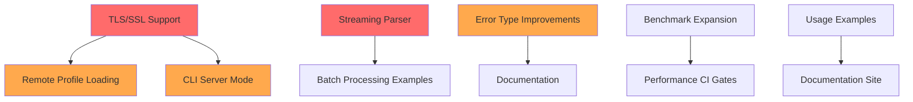

# HL7v2-rs Phase 2 Buildout Plan

**Analysis Date**: 2026-02-27
**Current Version**: v1.2.0 (~78% complete)
**Target**: Enterprise-ready v2.0.0

---

## Executive Summary

The hl7v2-rs workspace has solid foundations with core parsing, validation, MLLP transport, and HTTP server implementations. This plan identifies prioritized Phase 2 tasks to achieve enterprise readiness.

### Overall Assessment

| Area | Status | Priority |
|------|--------|----------|
| TLS/SSL Support | Not Started | **Critical** |
| Documentation | Good | Low |
| Usage Examples | Minimal | Medium |
| Benchmarking | Basic | Medium |
| Feature Completion | 78% | High |

---

## Priority 1: Critical Security & Infrastructure

### 1.1 TLS/SSL Support for MLLP

**Status**: ❌ Not Started
**Complexity**: High
**Affected Crates**: `hl7v2-network`

**Current State**:
- MLLP client/server implemented in [`crates/hl7v2-network/`](crates/hl7v2-network/src/lib.rs)
- TCP-only connections via [`MllpClient`](crates/hl7v2-network/src/client.rs:44) and [`MllpServer`](crates/hl7v2-network/src/server.rs)
- No TLS encryption support

**Required Work**:
- [ ] Add rustls or native-tls dependency to `hl7v2-network/Cargo.toml`
- [ ] Create `TlsConfig` struct for certificate/key configuration
- [ ] Implement `MllpTlsClient` with `tokio-rustls` integration
- [ ] Implement `MllpTlsServer` with certificate loading
- [ ] Add mTLS (mutual TLS) support for client certificate validation
- [ ] Update [`MllpClientBuilder`](crates/hl7v2-network/src/client.rs:44) with TLS options

**Dependencies**: None
**Files to Modify**:
- `crates/hl7v2-network/Cargo.toml`
- `crates/hl7v2-network/src/lib.rs`
- `crates/hl7v2-network/src/client.rs`
- `crates/hl7v2-network/src/server.rs`
- New: `crates/hl7v2-network/src/tls.rs`

---

### 1.2 Streaming Parser Completion

**Status**: ⚠️ Partial (70%)
**Complexity**: High
**Affected Crates**: `hl7v2-stream`

**Current State** (from [`IMPLEMENTATION_STATUS.md`](IMPLEMENTATION_STATUS.md:27)):
- ✅ Event-based parsing with `StreamParser`
- ✅ Delimiter discovery from MSH segment
- ❌ Backpressure/bounded channels
- ❌ Memory bounds enforcement
- ❌ Resume across buffer boundaries

**Required Work**:
- [ ] Add `BoundedChannel<Event>` with configurable capacity
- [ ] Implement queue overflow handling strategies
- [ ] Track cumulative buffer memory usage
- [ ] Add RSS monitoring test
- [ ] Implement `resume_from(byte_offset)` API
- [ ] Add incremental chunk parsing tests

**Dependencies**: None
**Files to Modify**:
- `crates/hl7v2-stream/src/lib.rs`
- `crates/hl7v2-stream/src/parser.rs` (or equivalent)

---

## Priority 2: High-Value Features

### 2.1 Remote Profile Loading

**Status**: ❌ Not Started
**Complexity**: Medium
**Affected Crates**: `hl7v2-prof`

**Required Work**:
- [ ] HTTP/HTTPS fetching with `reqwest`
- [ ] ETag/If-None-Match caching
- [ ] S3 Profile Loading (AWS SDK)
- [ ] GCS Profile Loading (GCP SDK)
- [ ] Local file LRU cache (100MB default)

**Dependencies**: TLS support for HTTPS
**Files to Modify**:
- `crates/hl7v2-prof/src/lib.rs`
- New: `crates/hl7v2-prof/src/remote.rs`
- New: `crates/hl7v2-prof/src/cache.rs`

---

### 2.2 CLI Server Mode Enhancement

**Status**: ⚠️ Partial
**Complexity**: Medium
**Affected Crates**: `hl7v2-cli`, `hl7v2-server`

**Current State**:
- HTTP server exists in [`hl7v2-server`](crates/hl7v2-server/src/lib.rs)
- CLI serve command in [`serve.rs`](crates/hl7v2-cli/src/serve.rs:102)
- TODO comment: gRPC server implementation pending

**Required Work**:
- [ ] Complete HTTP endpoints (`/hl7/parse`, `/hl7/validate`, `/hl7/ack`)
- [ ] Implement gRPC server with `tonic`
- [ ] Add authentication middleware (Bearer token, OIDC)
- [ ] Add OpenTelemetry metrics
- [ ] Add health/readiness endpoints

**Dependencies**: TLS support for HTTPS
**Files to Modify**:
- `crates/hl7v2-cli/src/serve.rs`
- `crates/hl7v2-server/src/handlers.rs`
- `crates/hl7v2-server/src/routes.rs`
- New: `crates/hl7v2-server/src/grpc.rs`

---

### 2.3 Error Type Improvements

**Status**: ⚠️ Partial
**Complexity**: Low
**Affected Crates**: `hl7v2-mllp`, `hl7v2-prof`

**Current Issues** (from TODO search):
- [`hl7v2-mllp/src/lib.rs:104`](crates/hl7v2-mllp/src/lib.rs:104): Using `Error::InvalidCharset` for MLLP framing errors
- [`hl7v2-prof/src/lib.rs:260`](crates/hl7v2-prof/src/lib.rs:260): Using `Error::InvalidEscapeToken` for YAML errors

**Required Work**:
- [ ] Add `Error::InvalidMllpFrame` to `hl7v2-mllp`
- [ ] Add `Error::ProfileParseError` to `hl7v2-prof`
- [ ] Add `Error::RemoteProfileError` for HTTP/S3/GCS failures

**Dependencies**: None
**Files to Modify**:
- `crates/hl7v2-mllp/src/lib.rs`
- `crates/hl7v2-prof/src/lib.rs`
- `crates/hl7v2-model/src/lib.rs` (if centralized error types)

---

## Priority 3: Documentation & Examples

### 3.1 Usage Examples

**Status**: ⚠️ Minimal
**Complexity**: Low
**Affected Files**: `examples/`

**Current State**:
- Only profile YAML files exist in `examples/profiles/`
- No code examples for common use cases

**Required Work**:
- [ ] `examples/basic_parsing.rs` - Simple message parsing
- [ ] `examples/mllp_client.rs` - MLLP client usage
- [ ] `examples/mllp_server.rs` - MLLP server with handler
- [ ] `examples/validation.rs` - Profile-based validation
- [ ] `examples/message_generation.rs` - Test data generation
- [ ] `examples/batch_processing.rs` - FHS/BHS batch handling

**Dependencies**: None
**Files to Create**:
- `examples/basic_parsing.rs`
- `examples/mllp_client.rs`
- `examples/mllp_server.rs`
- `examples/validation.rs`
- `examples/message_generation.rs`
- `examples/batch_processing.rs`

---

### 3.2 Documentation Coverage

**Status**: ✅ Good
**Complexity**: Low
**Affected Crates**: All

**Current State**:
- All major crates have `//!` module-level docs
- Public APIs have `///` documentation
- Examples in doc comments

**Minor Gaps**:
- Some internal functions lack documentation
- Missing cross-crate links in docs

**Required Work**:
- [ ] Add missing `///` docs to internal utilities
- [ ] Add intra-doc links between crates
- [ ] Generate and publish rustdoc to GitHub Pages

**Dependencies**: None

---

## Priority 4: Performance & Testing

### 4.1 Benchmark Expansion

**Status**: ⚠️ Basic
**Complexity**: Medium
**Affected Crates**: `hl7v2-bench`

**Current Benchmarks**:
- [`parsing.rs`](crates/hl7v2-bench/benches/parsing.rs) - Small/large message parsing
- [`mllp.rs`](crates/hl7v2-bench/benches/mllp.rs) - MLLP wrap/parse
- [`escape.rs`](crates/hl7v2-bench/benches/escape.rs) - Escape/unescape
- [`memory.rs`](crates/hl7v2-bench/benches/memory.rs) - Memory usage

**Missing Benchmarks**:
- [ ] Network throughput (client/server round-trip)
- [ ] Validation performance with profiles
- [ ] Profile loading and compilation
- [ ] Batch processing (FHS/BHS)
- [ ] JSON serialization
- [ ] Concurrent connection handling

**Dependencies**: None
**Files to Create**:
- `crates/hl7v2-bench/benches/network.rs`
- `crates/hl7v2-bench/benches/validation.rs`
- `crates/hl7v2-bench/benches/batch.rs`
- `crates/hl7v2-bench/benches/json.rs`

---

### 4.2 Fuzz Testing

**Status**: ⚠️ Partial
**Complexity**: Medium
**Affected Crates**: `hl7v2-network`

**Current State**:
- Fuzz targets exist in `crates/hl7v2-network/fuzz/`
- `mllp_codec.rs`, `mllp_decode.rs`, `mllp_encode.rs`

**Required Work**:
- [ ] Add fuzz targets for parser
- [ ] Add fuzz targets for escape sequences
- [ ] Integrate with CI fuzzing (oss-fuzz)

**Dependencies**: None

---

## Priority 5: Nice-to-Have

### 5.1 Expression Engine Hardening

**Status**: 🔄 In Progress
**Complexity**: Medium
**Affected Crates**: `hl7v2-prof`

**Required Work**:
- [ ] Pre-compile regex patterns at profile load
- [ ] Time-bound evaluation (100ms default timeout)
- [ ] Whitelist allowed expression patterns

**Dependencies**: None

---

### 5.2 Corpus Manifest

**Status**: ❌ Not Started
**Complexity**: Low
**Affected Crates**: `hl7v2-faker`

**Required Work**:
- [ ] Generate `manifest.json` with SHA-256 hashes
- [ ] Add `gen --verify-manifest` command
- [ ] Track generation seed and tool version

**Dependencies**: None

---

## Task Dependency Graph

---

## Summary Table

| Task | Priority | Complexity | Dependencies | Affected Crates |
|------|----------|------------|--------------|-----------------|
| TLS/SSL Support | Critical | High | None | hl7v2-network |
| Streaming Parser | Critical | High | None | hl7v2-stream |
| Remote Profile Loading | High | Medium | TLS | hl7v2-prof |
| CLI Server Mode | High | Medium | TLS | hl7v2-cli, hl7v2-server |
| Error Type Improvements | High | Low | None | hl7v2-mllp, hl7v2-prof |
| Usage Examples | Medium | Low | None | examples/ |
| Documentation | Medium | Low | None | All |
| Benchmark Expansion | Medium | Medium | None | hl7v2-bench |
| Fuzz Testing | Medium | Medium | None | hl7v2-network |
| Expression Engine | Low | Medium | None | hl7v2-prof |
| Corpus Manifest | Low | Low | None | hl7v2-faker |

---

## Recommended Execution Order

1. **Sprint 1-2**: TLS/SSL Support + Error Type Improvements
2. **Sprint 3-4**: Streaming Parser Completion
3. **Sprint 5-6**: Remote Profile Loading + CLI Server Mode
4. **Sprint 7**: Usage Examples + Documentation
5. **Sprint 8**: Benchmark Expansion + Fuzz Testing
6. **Ongoing**: Expression Engine, Corpus Manifest

---

## Notes

- All crates currently compile and pass tests
- Test coverage is comprehensive (unit, integration, property-based)
- Documentation quality is above average for a Rust project
- The main gap is production-ready security (TLS) and operational features (observability)
