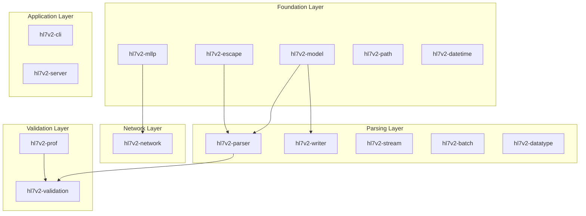

# HL7v2-rs Workspace Analysis and Improvement Recommendations

**Analysis Date:** 2026-02-27
**Project Version:** v1.2.0 (78% complete)
**Workspace Size:** 35 crates

---

## Executive Summary

The hl7v2-rs project is a well-architected Rust implementation of an HL7 v2 parser, validator, and generator. The codebase follows the Single Responsibility Principle with focused microcrates, has comprehensive documentation with module-level docs (`//!`) across all crates, and implements a thorough testing strategy including unit, integration, property-based, BDD, fuzz, and snapshot tests.

### Overall Health: **Good** ✅

| Category | Status | Notes |
|----------|--------|-------|
| Core Parsing | 100% | Fully functional |
| MLLP Framing | 100% | Complete implementation |
| Network Module | 95% | Client/server/codec done, TLS pending |
| HTTP Server | 90% | Operational with auth, metrics pending |
| Profile Validation | 100% | Inheritance and merging complete |
| Message Generation | 100% | Deterministic with realistic data |
| Streaming Parser | 70% | Missing backpressure and memory bounds |
| CLI | 80% | Some flags not implemented |

---

## Current State Details

### What's Working Well

1. **Microcrate Architecture**
   - 35 focused crates following SRP
   - Clean separation of concerns
   - Re-exports in facade crates for backward compatibility

2. **Documentation**
   - Module-level documentation (`//!`) in all crates
   - Code examples in doc comments
   - Comprehensive IMPLEMENTATION_STATUS.md tracking

3. **Testing Infrastructure**
   - Multi-layered testing: unit, integration, property-based, BDD, fuzz, snapshot
   - Shared test utilities crate (`hl7v2-test-utils`)
   - Benchmarks in `hl7v2-bench`

4. **Core Features Complete**
   - [`hl7v2-parser`](crates/hl7v2-parser) - Message parsing
   - [`hl7v2-writer`](crates/hl7v2-writer) - Message serialization
   - [`hl7v2-mllp`](crates/hl7v2-mllp) - MLLP framing
   - [`hl7v2-escape`](crates/hl7v2-escape) - Escape sequence handling
   - [`hl7v2-validation`](crates/hl7v2-validation) - Data type validation
   - [`hl7v2-network`](crates/hl7v2-network) - MLLP client/server

### Known Gaps (from IMPLEMENTATION_STATUS.md)

1. **Expression Engine** - Uses crude string pattern matching
2. **Zero-Copy Claims** - Documentation overstates; uses `Vec<u8>` not borrowed slices
3. **CLI Flag Gaps** - `--streaming`, `--distributions`, `--report` not implemented
4. **Parse Endpoint Test** - Integration test currently ignored

---

## Top 3 Additional Improvements

### 1. Complete Streaming Parser Improvements (HIGH PRIORITY)

**Current Status:** 70% complete

**Why This Matters:**
The streaming parser is critical for processing large HL7 messages in production environments without excessive memory usage. Without backpressure and memory bounds, the parser could exhaust memory on malicious or corrupted input.

**What's Needed:**
- [ ] Backpressure with bounded channels (`BoundedChannel<Event>`)
- [ ] Memory bounds enforcement with RSS monitoring
- [ ] Resume parsing across buffer boundaries (`resume_from(byte_offset)`)
- [ ] Enhanced escape sequence support (`\H\...\N\` highlights, hex/base64)

**Files to Modify:**
- [`crates/hl7v2-stream/src/lib.rs`](crates/hl7v2-stream/src/lib.rs)
- [`crates/hl7v2-stream/tests/large_file_tests.rs`](crates/hl7v2-stream/tests/large_file_tests.rs)

**Estimated Effort:** 40-50 story points

---

### 2. Expression Engine Improvements (HIGH PRIORITY)

**Current Status:** Crude pattern matching (60% complete)

**Why This Matters:**
The validation system relies on the expression engine for cross-field rules, temporal comparisons, and contextual validation. The current string-matching approach is limited and potentially error-prone.

**What's Needed:**
- [ ] Proper expression parsing (AST-based)
- [ ] Time-bound evaluation with guardrails
- [ ] Safe execution sandbox
- [ ] Support for complex nested expressions

**Files to Modify:**
- [`crates/hl7v2-validation/src/lib.rs`](crates/hl7v2-validation/src/lib.rs)
- [`crates/hl7v2-prof/src/lib.rs`](crates/hl7v2-prof/src/lib.rs)

**Estimated Effort:** 30-40 story points

---

### 3. CLI Feature Completion (MEDIUM PRIORITY)

**Current Status:** 80% complete with documented flags not implemented

**Why This Matters:**
Users expect documented CLI flags to work. Non-functional flags create confusion and reduce trust in the tool.

**What's Needed:**
- [ ] Implement `--report` flag for JSON validation reports
- [ ] Implement `--envelope` flag for envelope handling
- [ ] Implement `--streaming` flag for large file processing
- [ ] Add TOML configuration file support
- [ ] Add environment variable overrides

**Files to Modify:**
- [`crates/hl7v2-cli/src/main.rs`](crates/hl7v2-cli/src/main.rs)
- [`crates/hl7v2-cli/src/tests.rs`](crates/hl7v2-cli/src/tests.rs)

**Estimated Effort:** 20-30 story points

---

## Recommended Next Actions

### Immediate (This Sprint)

1. **Fix Ignored Test** - Enable and fix the ignored parse endpoint test in [`crates/hl7v2-server/tests/parse_endpoint_test.rs`](crates/hl7v2-server/tests/parse_endpoint_test.rs)

2. **Update Documentation** - Clarify zero-copy limitations in docs to set accurate expectations

3. **Run Full Test Suite** - Execute `cargo test --workspace` to verify all tests pass

### Short-term (Next 2-4 Sprints)

4. **Streaming Parser Backpressure** - Implement bounded channels in [`hl7v2-stream`](crates/hl7v2-stream)

5. **CLI Report Flag** - Implement `--report` flag for validation output

6. **Expression Engine Design** - Create design document for AST-based expression engine

### Medium-term (v1.2.0 Completion)

7. **Memory Bounds** - Add RSS monitoring and memory pressure signals to streaming parser

8. **TLS Support** - Complete TLS implementation in [`hl7v2-network`](crates/hl7v2-network)

9. **Remote Profile Loading** - Implement HTTP/HTTPS profile fetching with ETag caching

---

## Architecture Observations

### Strengths

### Test Coverage by Type

| Test Type | Tool | Coverage |
|-----------|------|----------|
| Unit Tests | Built-in `#[test]` | All crates |
| Integration Tests | Built-in | Most crates |
| Property-based | proptest | 15+ crates |
| BDD Tests | cucumber-rs | core, validation, cli |
| Snapshot Tests | insta | parser, validation |
| Fuzz Tests | cargo-fuzz | mllp, network |
| Benchmarks | criterion | hl7v2-bench |

---

## Conclusion

The hl7v2-rs project is well-structured and production-ready for core use cases. The top 3 improvements identified focus on completing the streaming parser for production robustness, improving the expression engine for better validation, and finishing CLI features for user experience. These improvements align with the v1.2.0 roadmap and will bring the project to enterprise-ready status.
